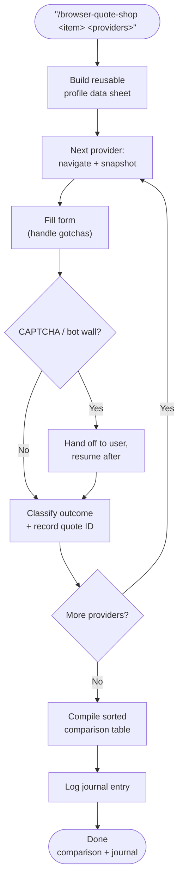

# browser-quote-shop

Drives the Playwright MCP browser to shop one item — insurance, a service, a product — across a list of online providers, then compiles a single comparison table sorted by price with a recommendation. Each provider's outcome is classified and recorded with its quote ID and callback number. Bakes in the recurring browser-automation gotchas so they aren't rediscovered every run.

## What It Does

- Reuses one profile data sheet across every provider's form
- Classifies each result: live quote / agent-only / not available in state / not eligible
- Compiles a sorted comparison table + conclusion (best option, saving vs incumbent)
- Logs a reverse-chronological journal entry linking the comparison note
- Documents form gotchas: address autocomplete, press-and-hold CAPTCHAs, ng-select multi-selects, expiring refs, broker auto-pull

## Workflow



## Install

```bash
mkdir -p ~/.claude/skills
cp -r browser-quote-shop ~/.claude/skills/
```

## Usage

```
/browser-quote-shop home insurance for 123 Example St across Mercury, Farmers, Progressive
/browser-quote-shop auto insurance, providers: GEICO, Progressive, Mercury
```

## Output

- A `Clean/` comparison note: sorted table + conclusion
- Raw quote IDs / callback numbers in `Projects/`
- A `HH:MM` reverse-chronological journal entry

**Sample output** (illustrative values):

```
| Provider   | Result                  | Quote/Notes                          |
| Provider A | ✅ Live quote: $2,900/yr | Quote #0000-0000 · saves $500 vs cur |
| Provider B | ✅ Live quote: $3,100/yr | Higher deductible option             |
| Provider C | Agent-only              | Quote ID ABC123 · call 800-000-0000  |
| Provider D | Not available in state  | Market withdrawal for this ZIP       |
Conclusion: Provider A at $2,900/yr saves ~$500 vs incumbent.
```

## Requirements

- Playwright MCP browser tools
- A target vault (optional — table can be produced inline)

## Supported Inputs / Edge Cases

- Press-and-hold CAPTCHA → hands off to user, resumes after
- ng-select multi-select → JS-injects the filter value, then clicks the option
- Broker engine prefill → verifies and corrects auto-pulled public records
- Market-withdrawal blocks → records the block reason, not a silent failure

## Skill Structure

```
browser-quote-shop/
├── SKILL.md
└── README.md
```
