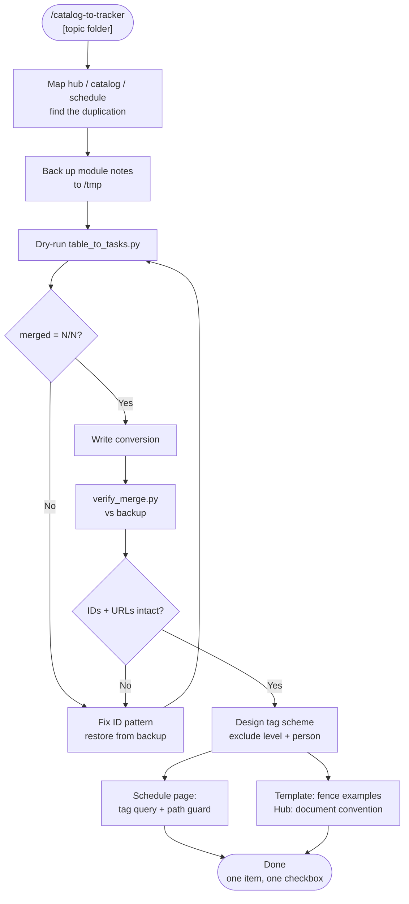

# catalog-to-tracker

Turns a reference **catalog** living in Obsidian tables — a course skill tree, curriculum,
drill library, reading list — into a **tracker**: one checkbox per item, grouped, in
catalog order. If the same items were also hand-copied into a separate "scheduled" list,
those get folded back into the catalog line they belong to, so each item has exactly one
checkbox. A schedule page then *queries* those lines by tag instead of duplicating them.

The invariant: **one item, one checkbox, one place.** The weekly plan and the progress
dashboard are views, not copies.

## What It Does

- Rewrites a `## Items` table as `### Group` headings + `- [ ] [A.1 Title](url)` checkboxes
- Merges a duplicate scheduled-items section into the catalog **by stable ID**, preserving
  the day prefix, week tag, `✅` completion date, and any score note verbatim
- Parks scheduled items with no catalog match under a visible bucket — never drops them
- Verifies the result against a pre-change backup: no ID lost, none duplicated, no URL lost
- Guides the **tag scheme** design: what belongs in a scheduling tag and — more importantly
  — what must stay out of it (level/grade, person)
- Fences template example tasks so a `_Template.md` never pollutes live queries
- Documents the resulting convention on the durable hub note

## Workflow



## Install

```bash
git clone https://github.com/biomystery/claude-skills.git
cp -r claude-skills/catalog-to-tracker ~/.claude/skills/
```

## Usage

```bash
# in Claude Code, from the vault
/catalog-to-tracker Study/Piano

# or drive the scripts directly
python3 ~/.claude/skills/catalog-to-tracker/scripts/table_to_tasks.py \
  --file "Study/Piano/Modules/M01 Scales.md" \
  --items-heading "## Items" \
  --merge-heading "## Scheduled Practice" \
  --dry-run

python3 ~/.claude/skills/catalog-to-tracker/scripts/verify_merge.py \
  --backup /tmp/piano-backup --current "Study/Piano/Modules"
```

## Output

**Before** — the same item is checkable in two places:

```markdown
## Scheduled Practice
- [x] Mon · A.1 [Major scales, two octaves](https://example.com/a1) ✅ 2026-01-05 #plan-wk1

## Items
| Item | Period | Status |
|---|---|---|
| **A. Scales** | — | |
| [A.1 Major scales, two octaves](https://example.com/a1) | — | ⬜ |
| [A.2 Natural minor scales](https://example.com/a2) | — | ⬜ |
```

**After** — one checkbox, scheduling expressed as a tag on that same line:

```markdown
## Items

> [!info] These checkboxes are the source of truth
> A line tagged `#piano26-wkN` is scheduled into week N of the practice schedule.

### A. Scales
- [x] Mon · [A.1 Major scales, two octaves](https://example.com/a1) ✅ 2026-01-05 #piano26-wk1
- [ ] [A.2 Natural minor scales](https://example.com/a2)
```

**Sample run** (illustrative values):

```
  M01 Scales.md: 24 items, 8/8 merged
  M02 Arpeggios.md: 31 items, 5/5 merged
  M03 Etudes.md: 18 items, 0/0 merged
converted 3 file(s)

  M01 Scales.md: 24 unique IDs, 8 duplicate occurrence(s) merged
  M02 Arpeggios.md: 31 unique IDs, 5 duplicate occurrence(s) merged
  M03 Etudes.md: 18 unique IDs, 0 duplicate occurrence(s) merged

checked 3 file(s)
all checks passed
```

## Tag scheme cheat-sheet

`#<subject><cycle>-wk<N>` → `#piano26-wk3`

| Dimension | In tag? | Reason |
|---|---|---|
| Subject | yes | the axis a query must never cross |
| Cycle (year/season/cohort) | yes | week numbers recycle; prevents next year's `wk1` colliding |
| Week number | yes | the grouping the schedule renders |
| Level / grade / difficulty | **no** | an easier fallback variant must share the tag, or swapping levels breaks the week's query |
| Person | **no** | already in the path; use `path includes <folder>` in the query |

## Requirements

- Python 3 (stdlib only)
- Obsidian with the **Tasks** plugin for the query blocks
- Catalog items must carry a stable ID (`A.1`, `BB.12`) — add IDs before running

## Supported inputs / edge cases

| Input | Handling |
|---|---|
| Catalog with no duplicate section | Omit `--merge-heading`; it just converts the table |
| Scheduled ID absent from the catalog | Parked under `### Scheduled — not found in catalog` |
| ID written before *or* inside the link | Both parsed; output normalizes to inside the link |
| Non-standard ID codes | `--id-pattern '<regex>'` |
| Prose paragraphs inside the section | Preserved |
| Files with no `updated:` frontmatter | Left alone; `--no-stamp` disables stamping entirely |
| Emoji / CJK / `·` in lines | Handled — the scripts do explicit UTF-8 I/O rather than string-matching edits |

## Skill Structure

```
catalog-to-tracker/
├── SKILL.md
├── README.md
└── scripts/
    ├── table_to_tasks.py
    └── verify_merge.py
```
