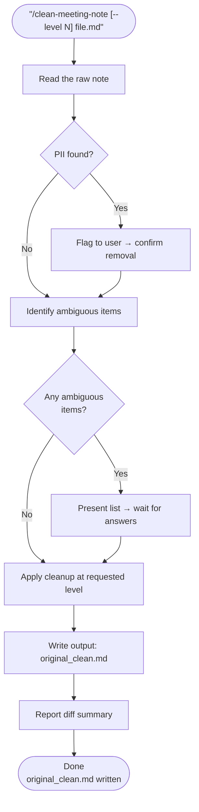

# clean-meeting-note

Takes a raw shorthand meeting note and produces a clean version — preserving the author's original voice, resolving typos and structure, and asking before touching anything ambiguous. Supports three levels of cleanup via `--level`.

## What It Does

- Fixes typos and capitalization of proper nouns
- Optionally reorders sections and repairs bullet hierarchy
- Flags ambiguous shorthand and asks for clarification before editing (HITL)
- Scans for PII and confirms removal with the user
- Writes output as `<original-name>_clean.md` in the same folder

## Cleanup Levels

| Level | Scope |
|---|---|
| `--level 1` | Typos + capitalization only |
| `--level 2` | Level 1 + section reorder + bullet hierarchy (default) |
| `--level 3` | Level 2 + header normalization + shorthand expansion |

## Workflow



## Install

Add to your Claude Code skills directory or reference via your skills repo.

## Usage

```
/clean-meeting-note Meeting Notes 2026-05-21.md
/clean-meeting-note --level 1 rough-notes.md
/clean-meeting-note --level 3 product-review.md
```

## Output

**Sample output summary** (illustrative):
```
Sections reordered: yes (Goal → Projects → Action)
Typos fixed: 6
Ambiguous items resolved: 3
PII removed: no
Output: Meeting Notes 2026-05-21_clean.md
```

## Requirements

- Input must be a `.md` file
- User must be present to answer HITL questions

## Supported Inputs / Edge Cases

- Mixed-language notes (e.g. EN + Chinese) — languages preserved as-is
- Deeply nested bullet structures — hierarchy fixed, content unchanged
- Shorthand / abbreviations — flagged via HITL, not guessed
- Notes with no section headers — level 1/2 still applies; level 3 adds headers

## Skill Structure

```
clean-meeting-note/
├── SKILL.md
└── README.md
```
