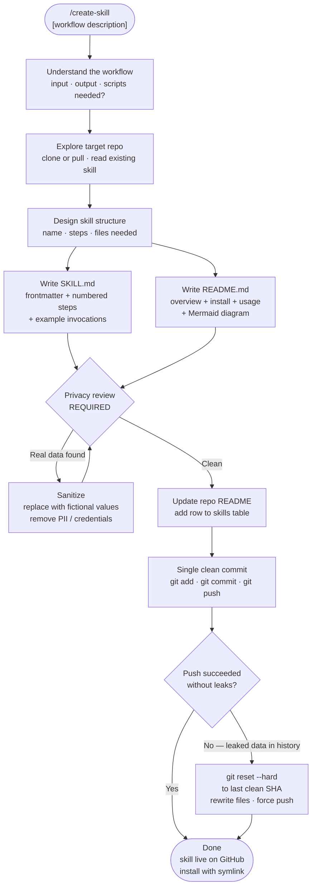

# create-skill

A meta Claude Code skill that turns any repeatable workflow into a shareable, installable skill. Handles the full authoring lifecycle: SKILL.md, README.md with a Mermaid diagram, mandatory privacy review, and a single clean Git commit.

## What It Does

- Guides you through capturing a workflow as a reusable Claude Code slash command
- Writes `SKILL.md` (the instruction file Claude executes) and `README.md` (user docs)
- Generates a Mermaid flowchart diagram illustrating the workflow
- Runs a privacy review before any `git` operation to prevent sensitive data leaks
- Publishes to a GitHub skills repository as one clean commit — with a recovery protocol if history needs to be rewritten

## Workflow



## Install

```bash
git clone https://github.com/biomystery/claude-skills.git
mkdir -p ~/.claude/skills
ln -s "$(pwd)/claude-skills/create-skill" ~/.claude/skills/create-skill
```

Restart Claude Code — `/create-skill` will be available.

## Usage

```bash
# Interactive — Claude asks for workflow details
/create-skill

# With a seed description
/create-skill "extract tables from PDFs and output a CSV"

# Targeting a specific repo
/create-skill --repo https://github.com/you/your-skills
```

## Output

Two files committed to the target GitHub repository:

| File | Purpose |
|------|---------|
| `<skill-name>/SKILL.md` | Instruction file Claude reads and executes |
| `<skill-name>/README.md` | User-facing docs with Mermaid workflow diagram |

## Key Lessons Encoded in This Skill

### Privacy — sanitize before every commit

Any sample output, example table, or illustrative value must use **fictional data** — never figures copied from a real document you processed while developing the skill. This applies even when the numbers seem harmless in isolation (income figures, file counts, timestamps).

If real data slips into a commit, a follow-up "fix" commit is **not enough** — the original data remains in git history. The correct recovery is:

```bash
git reset --hard <last-clean-sha>   # erase leaking commits locally
# rewrite files cleanly, then:
git push --force origin main        # rewrite remote history
```

### Mermaid diagram — always include in README

Every skill README should have a `## Workflow` section with a `flowchart TD` Mermaid diagram. It:
- Makes the skill self-documenting at a glance
- Shows decision branches (strategy A vs B, found vs not-found)
- Renders natively on GitHub without any extra tooling

Keep diagrams to 8–15 nodes. Use `\n` inside node labels for readability.

### Scripts — only when truly needed

Add a `scripts/` directory only when the task requires non-trivial computation (e.g., image compositing, ML inference) that cannot be expressed as CLI commands + Claude's own tools. Most skills — including ones that process PDFs, parse text, or write structured output — need only `SKILL.md` and `README.md`.

### Single clean commit

Publish as **one commit** per skill, not an iterative series of "add skill / fix privacy / fix typo" commits. If you need to fix something before the final push, amend or reset locally first.

## Requirements

- **Git** with push access to the target skills repo
- No additional tools — Claude uses its built-in Write/Edit/Bash tools for all authoring

## Skill Structure

```
create-skill/
├── SKILL.md    (skill definition — Claude reads this)
└── README.md   (this file)
```
