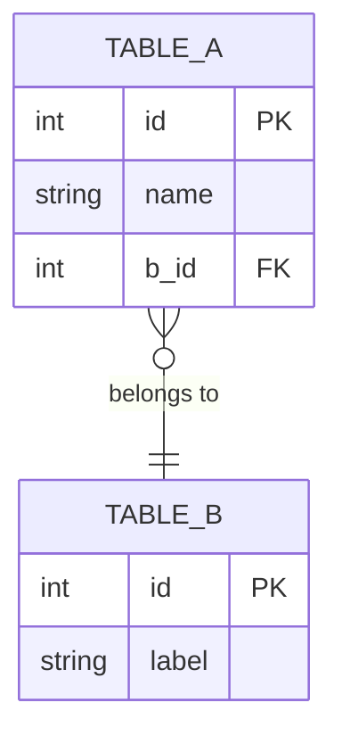

# Data Dictionary Generator

Generates a structured, human-readable markdown data dictionary by auto-detecting the schema source and database engine, then querying the live database for statistics, distributions, sample rows, and data quality metrics.

## When to Use

- User asks to "create a data dictionary", "document the database", or "generate schema docs"
- User wants to onboard new team members to the database structure
- User wants an up-to-date reference for all tables, columns, and relationships
- User wants a data quality overview (null rates, value distributions)

## Example Invocations

```
/data-dictionary
/data-dictionary --output reports/schema_ref.md
/data-dictionary --lang zh
/data-dictionary --output docs/db.md --lang es
create a data dictionary for this project
document the database schema
generate schema docs
```

---

## Instructions

### Step 0: Parse Arguments & Ask Clarifying Questions

**Parse optional flags from the user's invocation:**
- `--output <path>` — override default output file (default: `docs/data_dictionary.md`)
- `--lang <code>` — output language code, e.g. `en`, `zh`, `es` (default: `en`)

**Then ask the user (in a single message):**
> I'll generate a data dictionary for this project. A couple of quick questions:
>
> 1. Do you have a **domain glossary** — business definitions for any terms used in column or table names? (e.g. "lot_number = the GMP batch identifier assigned at manufacturing start"). If yes, paste them or point me to a file. If no, just say skip.
> 2. Are there any **tables or columns to exclude** (e.g. internal audit tables, PII columns)?
>
> You can answer both or just say "skip both" to proceed with defaults.

Wait for the user's response before continuing. Incorporate any glossary terms and exclusion lists into the output.

---

### Step 1: Auto-Detect Schema Source

Search the project for schema files in this priority order:

| Priority | Schema Type | Detection |
|----------|-------------|-----------|
| 1 | **Prisma** | `prisma/schema.prisma` or any `**/*.prisma` file |
| 2 | **SQL DDL** | `schema.sql`, `**/schema.sql`, or `**/*.sql` with `CREATE TABLE` |
| 3 | **Django** | `**/models.py` files |
| 4 | **SQLAlchemy** | Python files containing `Column(`, `relationship(` |
| 5 | **No schema file** | Fall back to introspecting the live DB directly |

**For each schema type:**

- **Prisma** → Read the `.prisma` file. Extract models (tables), fields (columns), types, `@id`, `@unique`, `@default`, `@@index`, relations, and enums.
- **SQL DDL** → Read and parse `CREATE TABLE` statements. Extract column names, types, `NOT NULL`, `DEFAULT`, `PRIMARY KEY`, `FOREIGN KEY`, `INDEX`.
- **Django models.py** → Read model classes. Extract field types (`CharField`, `IntegerField`, etc.), `null=True`, `blank=True`, `ForeignKey`, `unique=True`, `db_index=True`.
- **SQLAlchemy** → Read `Column(...)` definitions. Extract type, `nullable`, `primary_key`, `index`, `ForeignKey`.
- **No schema** → Use DB introspection (see Step 2 fallback).

Also capture the **git commit hash** of the schema file:
```bash
git log -1 --format="%h %ai" -- <schema_file_path>
```

---

### Step 2: Locate & Connect to the Database

**Auto-detect database type and connection:**

```bash
# 1. Check for .env or .env.local for DATABASE_URL
grep -r "DATABASE_URL" .env .env.local .env.production 2>/dev/null | head -5

# 2. Search for SQLite files
find . -name "*.db" -not -path "*/node_modules/*" -not -path "*/.git/*" 2>/dev/null
```

**Determine the DB engine from DATABASE_URL or file extension:**

| Pattern | Engine | Query tool |
|---------|--------|------------|
| `file:` / `.db` / `.sqlite` | SQLite | `sqlite3 <file> "<sql>"` |
| `postgresql://` / `postgres://` | PostgreSQL | `psql "$DATABASE_URL" -t -A -c "<sql>"` |
| `mysql://` | MySQL | `mysql -e "<sql>" <db_name>` |
| `.duckdb` / `duckdb://` | DuckDB | `duckdb <file> "<sql>"` |

**If no DB is accessible**, document schema-only (mark all statistics as "N/A — DB not accessible") and note this clearly in the output header.

**Fallback introspection (when no schema file found):**

```sql
-- SQLite: list all tables
SELECT name FROM sqlite_master WHERE type='table' AND name NOT LIKE 'sqlite_%';

-- SQLite: get column info per table
PRAGMA table_info(<table>);
PRAGMA index_list(<table>);
PRAGMA foreign_key_list(<table>);

-- PostgreSQL: list tables
SELECT table_name FROM information_schema.tables WHERE table_schema = 'public';

-- PostgreSQL: column info
SELECT column_name, data_type, is_nullable, column_default
FROM information_schema.columns WHERE table_name = '<table>';
```

**Skip internal/system tables:**
- SQLite: `sqlite_sequence`, `_prisma_migrations`, `sqlite_stat*`
- PostgreSQL: `pg_*`, `information_schema.*`
- Django: `django_migrations`, `django_content_type`, `auth_permission`

---

### Step 3: Query Live Data Statistics

For each table, run these queries. Batch independent queries in a single Bash call.

#### 3a. Row count & basic completeness

```sql
-- Row count + null rate for every column (SQLite example — adapt for other engines)
SELECT
  COUNT(*) as total_rows,
  COUNT(<col>) as non_null_<col>,
  ROUND(100.0 * (COUNT(*) - COUNT(<col>)) / COUNT(*), 1) as null_pct_<col>
FROM <table>;
```

#### 3b. Numeric column statistics

For columns with numeric types (Int, Float, Decimal) or string columns where >80% of sampled values parse as numbers:

```sql
SELECT
  COUNT(<col>) as count,
  MIN(CAST(<col> AS REAL)) as min_val,
  MAX(CAST(<col> AS REAL)) as max_val,
  ROUND(AVG(CAST(<col> AS REAL)), 4) as mean_val
FROM <table> WHERE <col> IS NOT NULL AND <col> != '';
```

#### 3c. Categorical column distributions

For columns with string/enum types with low cardinality (≤ 30 distinct values):

```sql
SELECT <col>, COUNT(*) as cnt
FROM <table>
GROUP BY <col>
ORDER BY cnt DESC
LIMIT 20;
```

#### 3d. DateTime ranges

For DateTime/timestamp columns:

```sql
SELECT MIN(<col>), MAX(<col>) FROM <table> WHERE <col> IS NOT NULL;
```

> **Note for SQLite**: timestamps stored as integers (Unix ms) should be converted:
> `datetime(<col>/1000, 'unixepoch')` — detect by checking if values are large integers (> 1e9).

#### 3e. Sample rows (PII-aware)

For each table, fetch 3–5 representative rows:

```sql
SELECT * FROM <table> LIMIT 5;
```

**Automatically redact columns matching these name patterns** before including in output:
- `*email*`, `*password*`, `*secret*`, `*token*`, `*ssn*`, `*birth_date*`, `*phone*`, `*address*`
→ Replace values with `[REDACTED]`

---

### Step 4: Index & Constraint Collection

For each table, collect:

```bash
# SQLite
sqlite3 "$DB" "PRAGMA index_list(<table>);"
sqlite3 "$DB" "PRAGMA index_info(<index_name>);"
sqlite3 "$DB" "PRAGMA foreign_key_list(<table>);"

# PostgreSQL
psql -c "SELECT indexname, indexdef FROM pg_indexes WHERE tablename = '<table>';"
```

Record for each column:
- Is it a primary key?
- Is it a foreign key, and to which table/column?
- Is it indexed (unique or non-unique)?

---

### Step 5: Write the Data Dictionary

Write to the output path (default: `docs/data_dictionary.md`). Use the user's requested language for all prose (column descriptions, table descriptions, section headings). Technical identifiers (column names, SQL types, enum values) always stay in their original form.

#### File structure:

```markdown
# Data Dictionary

**Project**: <project name from package.json / pyproject.toml / directory name>
**Database**: <engine> — `<connection string or file path>`
**Schema source**: <file path and type> · git `<short hash>` (<date>)
**Generated**: <YYYY-MM-DD>
**Language**: <language>

> ⚠️ [Only include if DB was not accessible]: Statistics are unavailable —
> schema-only documentation generated.

---

## Quick Reference

| Table | Rows | Description |
|-------|------|-------------|
| [`table_name`](#section-anchor) | N | One-line description |
...

---

## Table of Contents
[grouped by logical domain, one bullet per table]

---

## Domain: <Group Name>

### `table_name`

**Description**: [what this entity represents, its role, and how it relates to the broader domain]

**Row count**: N
**Schema**: `<source_file>:<line_number>` (if available)

#### Columns

| Column | Type | Nullable | Default | Indexed | Description |
|--------|------|----------|---------|---------|-------------|
| `col` | Type | Yes/No | value | PK / FK→`table` / ✓ / — | Description. Null rate: X% |

#### Statistics

> Only include sections that apply to the table.

**Numeric columns** (min / max / mean):
| Column | Min | Max | Mean | Null % |
|--------|-----|-----|------|--------|

**Categorical distributions** (for columns with ≤ 30 distinct values):
| `col_name` value | Count | % |
|-----------------|-------|---|

**Date ranges**:
| Column | Earliest | Latest |
|--------|----------|--------|

#### Sample Data

> `birth_date` and `email` redacted.

| id | col1 | col2 | ... |
|----|------|------|-----|
| 1  | val  | val  | ... |

---

## Enumerations

### `EnumName`
> Used in: `table.column`

| Value | Description |
|-------|-------------|
| `VALUE` | [what it means in business terms] |

---

## Entity Relationship Diagram



## Glossary

> Only include if the user provided glossary terms.

| Term | Definition |
|------|-----------|
| term | definition |

---

## Data Quality Notes

Automatically flag and list:
- Tables with 0 rows
- Columns with > 50% null rate
- String columns used as numeric (stored as TEXT/VARCHAR but contain numbers)
- Timestamp columns where values appear to be Unix ms integers

```

---

### Step 6: Mermaid ER Diagram

Generate a `erDiagram` block. Rules:
- Include all non-system tables
- Show only the most important columns per table: PK, FKs, and 1–2 key business columns (skip audit fields like `created_at`)
- Use Mermaid cardinality notation:
  - `||--||` one-to-one
  - `||--o{` one-to-many (optional)
  - `||--|{` one-to-many (required)
  - `}o--o{` many-to-many
- Label each relationship with a short verb phrase (e.g. `"belongs to"`, `"has many"`)
- If there are > 20 tables, split into domain sub-diagrams

---

### Step 7: Quality Checklist

Before saving, verify:
- [ ] Every non-system table is documented
- [ ] Every column has a description
- [ ] Null rates are shown for every nullable column
- [ ] Numeric stats shown for all numeric columns
- [ ] Categorical distribution shown for all enum/low-cardinality columns
- [ ] Sample rows shown for every table (or noted as empty)
- [ ] All enums documented in the Enumerations section
- [ ] Mermaid ER diagram renders (valid syntax)
- [ ] Quick Reference table at the top covers all tables
- [ ] Data Quality Notes section lists any anomalies found
- [ ] PII columns are redacted in sample rows

---

## Notes for Schema-Specific Parsing

### Prisma
- `@id` → Primary Key
- `@unique` / `@@unique([...])` → Unique constraint
- `@@index([...])` → Non-unique index
- `@default(...)` → Default value
- Relations defined with `@relation` → Foreign key, note `fields` and `references`
- Enums → Document in Enumerations section

### SQL DDL
- `PRIMARY KEY` → PK
- `REFERENCES table(col)` → FK
- `NOT NULL` → Nullable: No
- `DEFAULT val` → Default value
- `CREATE INDEX` / `CREATE UNIQUE INDEX` → index

### Django models.py
- `ForeignKey(Model, ...)` → FK; `on_delete` behavior worth noting
- `null=True` → Nullable: Yes
- `unique=True` → Unique index
- `db_index=True` → Non-unique index
- `choices=` → Document as categorical with allowed values

### SQLAlchemy
- `primary_key=True` → PK
- `ForeignKey('table.col')` → FK
- `nullable=False` → Nullable: No
- `index=True` → Non-unique index
- `unique=True` → Unique index
