# epub-to-kindle

A Claude Code skill that converts an EPUB (or any Calibre-supported ebook) into a Kindle-readable format — **AZW3** (modern) or **MOBI** (legacy) — using Calibre's `ebook-convert`. It auto-locates the CLI inside the macOS `.app` bundle, installs Calibre via Homebrew when missing, and surfaces the exact `sudo chown` command when `/opt/homebrew` permissions block the install.

## What It Does

- Disambiguates fuzzy format requests ("aws", "azw", "Kindle") → AZW3, or MOBI for legacy devices
- Finds `ebook-convert` on `$PATH` **or** inside `/Applications/calibre.app/Contents/MacOS/` (it's not on `$PATH` after a cask install)
- Installs Calibre via `brew install --cask calibre` if absent
- Detects the `/opt/homebrew` not-writable / `to_sym` Homebrew failure and prints the one-time `sudo chown` fix
- Converts and verifies the output file, leaving the original EPUB untouched

## Workflow

```mermaid
flowchart TD
    A(["/epub-to-kindle\n<input.epub> [azw3|mobi]"]) --> B{Format clear?}
    B -->|"'aws'/'azw'/ambiguous"| C[Confirm AZW3 vs MOBI]
    B -->|Yes| D[Check input exists]
    C --> D
    D --> E{ebook-convert\nfound?}
    E -->|"on PATH or in .app"| I[Run ebook-convert]
    E -->|No| F{brew prefix\nwritable?}
    F -->|No| G(["Stop — ask user to run\nsudo chown -R you /opt/homebrew\nin a real terminal"])
    F -->|Yes| H[brew install --cask calibre]
    H --> I
    I --> J{Output file\nexists?}
    J -->|No| K(["Error — conversion failed"])
    J -->|Yes| L(["Done\n<book>.azw3 written · side-load tips"])
```



## Install

```bash
git clone https://github.com/biomystery/claude-skills.git
mkdir -p ~/.claude/skills
ln -s "$(pwd)/claude-skills/epub-to-kindle" ~/.claude/skills/epub-to-kindle
```

Restart Claude Code — `/epub-to-kindle` will be available.

## Usage

```bash
# Convert to AZW3 (modern Kindle) — default
/epub-to-kindle ~/Downloads/book.epub

# Convert to MOBI (older Kindle / max compatibility)
/epub-to-kindle ~/Downloads/book.epub mobi

# Natural language also works — "aws" is read as AZW3
convert ~/Downloads/book.epub to aws format
```

You can also call the helper script directly:

```bash
epub-to-kindle/scripts/convert-ebook.sh ~/Downloads/book.epub azw3
```

## Output

A single Kindle file written next to the input (or to a path you specify). The source EPUB is not modified.

**Sample output** (illustrative values):

```
Using: /Applications/calibre.app/Contents/MacOS/ebook-convert
ebook-convert (calibre 9.9.0)
Converting -> ~/Downloads/sample-book.azw3
...
AZW3 output written to ~/Downloads/sample-book.azw3
OK: ~/Downloads/sample-book.azw3 (1100000 bytes)
```

Side-load it by copying into the Kindle's `documents` folder over USB, or email it to your Send-to-Kindle address.

## Requirements

- **macOS** with **Homebrew** (for the auto-install path), or Calibre already installed
- **Calibre** (`ebook-convert`) — installed automatically if missing
- Writable `/opt/homebrew` for auto-install (otherwise a one-time `sudo chown -R $(whoami) /opt/homebrew`)

## Supported Inputs / Edge Cases

- **Inputs:** any format Calibre's `ebook-convert` accepts — `.epub`, `.fb2`, `.lit`, `.pdb`, `.htmlz`, etc. (EPUB is the common case)
- **Outputs:** `azw3` (default) or `mobi`
- **CLI not on PATH:** the macOS cask installs the CLI inside the `.app` bundle; the script checks the bundle path explicitly
- **Homebrew owned by root:** `brew` dies with `undefined method 'to_sym'` or `not writable`; fix is `sudo chown -R $(whoami) /opt/homebrew` in a real terminal — the agent can't enter the sudo password through the `!`-prefix shell (no TTY)
- **Stale cask API cache:** can independently trigger the `to_sym` crash; the script clears `~/Library/Caches/Homebrew/api` automatically

## Key Design Decisions

**Check the `.app` bundle, not just `$PATH`.** Calibre's cask does not symlink `ebook-convert` onto `$PATH`. The reliable path is `/Applications/calibre.app/Contents/MacOS/ebook-convert`.

**Permission failures stop with instructions, not retries.** A non-writable `/opt/homebrew` needs interactive sudo that an automated agent cannot supply. The script detects this up front and prints the exact `chown` command rather than looping on a doomed `brew install`.

**AZW3 is the default.** It's the current Kindle (KF8) format; MOBI is offered only for older hardware.

## Skill Structure

```
epub-to-kindle/
├── SKILL.md    (instruction file Claude executes)
├── README.md   (this file)
└── scripts/
    └── convert-ebook.sh   (locate CLI · install Calibre · convert · verify)
```
