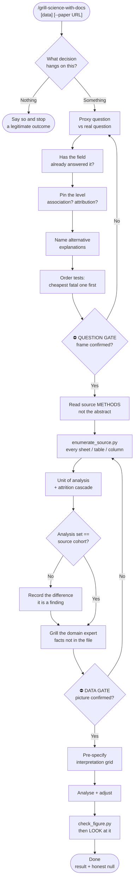

# grill-science-with-docs

A three-phase interrogation for scientific analysis you did not originate. Phase 0 grills the **question**, Phase 1 grills the **data** and the domain expert, each behind a hard gate. Only then does Phase 2 analyse.

Most wrong analyses are not statistical errors. They are **alignment errors**, in two layers:

| Layer | Failure | Cost |
|---|---|---|
| **Question** | You answered a *proxy* question extremely well | Rigorous work on the wrong thing |
| **Data** | You analysed a different cohort / unit / denominator than the question meant | Revisions that move the headline after it has shipped |

The question layer is the expensive one and gets grilled least.

## What It Does

**Phase 0 — the question**
- Names the **decision** that hangs on the answer, or stops if there isn't one
- Separates the **stated (proxy) question** from the one actually being asked
- Checks whether the **field already answered it** — turning a "finding" into "positioning" before someone presents it as new
- Pins the **level** — description / association / attribution / prediction — which determines the unit and the design
- Names the **strongest alternative explanation** up front, and runs the **cheapest fatal test first**

**Phase 1 — the data**
- Reads the **source document's methods**, not its abstract — abstracts systematically understate what was collected
- **Enumerates every container** in the source, so "there is no X" is never claimed from a partial scan
- Pins the **unit of analysis** and the **derivation cascade**, with an n and a reason at every step
- Compares your analysis set against the **source cohort** — they are often not the same population
- Forces you to **grill the human** for facts the file cannot state
- **Blocks analysis** until the picture is written down and confirmed

**Phase 2 — the work**
- Pre-specified interpretation grid → analysis → **rendered and inspected** figures → correction log → an explicit statement of what the data cannot settle

## Workflow



## Install

```bash
git clone https://github.com/biomystery/claude-skills ~/projects/claude-skills
ln -s ~/projects/claude-skills/grill-science-with-docs ~/.claude/skills/grill-science-with-docs
```

## Usage

```bash
/grill-science-with-docs
/grill-science-with-docs data/cohort.xlsx --paper https://doi.org/10.xxxx/yyyy
```

Standalone, outside a session:

```bash
python3 scripts/enumerate_source.py data/cohort.xlsx --grep 'dose|drug|treat'
python3 scripts/check_figure.py figures/fig1.png --source analysis/plots.py
```

## Output

**Sample enumeration** (illustrative values):

```
cohort.xlsx  —  6 sheet(s), 88 columns total
==============================================================================

[sheet] Measurements   rows=400   cols=52
       0  Subject ID
       1  Visit
    ...

FLAT INDEX — 88 columns across 6 sheet(s)
grep 'dose|drug|treat': 3 hit(s)
    [Prescriptions] Daily dose
    [Prescriptions] Drug class
    [MedChange] Treatment switched
```

The point of the flat index: the variable you were about to declare missing is usually sitting in a sheet you did not open.

**Sample figure lint** (illustrative values):

```
FIGURE  fig1.png
  1200x700, 18.4% non-background

SOURCE  plots.py
  [HIGH] line 42: hardcoded p-value in a string — interpolate the computed value
  [MED]  line 77: explicit bins silently DROP out-of-range values
  [HIGH] line 91: absolute claim in a caption — verify it holds in every stratum
```

## Requirements

- `python3` — `enumerate_source.py` is stdlib-only (reads `.xlsx` via the OOXML zip, no `openpyxl`)
- `Pillow` *optional* — enables the image half of `check_figure.py`; source linting works without it
- Network access to fetch the source document
- **A human at both gates** — this skill does not run unattended

## Supported inputs / edge cases

| Input | Handling |
|---|---|
| `.xlsx` / `.xlsm` | Every sheet enumerated, including ones the analysis never touches |
| `.csv` / `.tsv` | Headers + row count |
| `.sqlite` / `.db` | Every table and view, with row counts |
| Aggregated columns | Flagged in the picture — record what granularity is **unrecoverable** |
| Analysis set ≠ paper cohort | Treated as a finding, not a footnote |
| Multiple defensible denominators | Enumerate all, choose deliberately, state which is in force |
| An honest null | A legitimate deliverable — "not distinguishable here" is an answer |
| No decision hangs on the question | Phase 0 stops early and says so — also a legitimate deliverable |
| The field already answered it | Deliverable becomes positioning + prior art, not a new finding |

## Skill Structure

```
grill-science-with-docs/
├── SKILL.md
├── README.md
└── scripts/
    ├── enumerate_source.py
    └── check_figure.py
```
