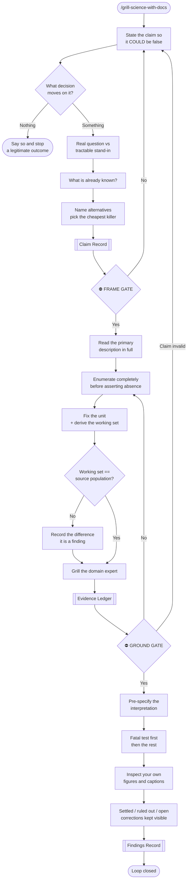

# grill-science-with-docs

A relentless interview that sharpens a scientific claim and **closes the loop** on it — producing durable records as it goes, the way `grill-with-docs` produces ADRs for an engineering design.

Most bad scientific work is not bad statistics. It is well-executed work on a claim nobody stated precisely, grounded in evidence nobody checked, that ends without anyone recording what is now known.

| Layer | Failure | Symptom |
|---|---|---|
| **Claim** | Answered a proxy question rigorously | Correct answer, wrong question |
| **Ground** | Assumed what the evidence contains | Result moves every time someone looks closer |
| **Test** | Interpretation chosen after seeing results | Story, not finding |
| **Close** | Nothing durable recorded | The next person redoes it |

## What It Does

Four phases, four gates, three artifacts.

**FRAME** — restate the claim so it *could be false*; name the decision that moves on it, or stop; separate the real question from the tractable stand-in; check what is already known; pin the level (description / association / attribution / prediction); name alternative explanations; pick the cheapest observation that could kill it.

**GROUND** — read the primary description in full; **enumerate the source completely before asserting absence**; fix the unit; derive the working set as a cascade; compare it against the source's own population; establish what is permanently unanswerable; grill the domain expert for what the source does not state.

**TEST** — pre-specify the interpretation; separate outcomes that share construction with the exposure from those that do not; interrogate every denominator; run the fatal test first; inspect your own figures.

**CLOSE** — answer the claim explicitly (including "undecided"); separate settled from open; keep corrections visible; distinguish relative from absolute; make it reproducible; report back so it strengthens rather than corners whoever asked.

## Artifacts

| Artifact | Holds | Analogue |
|---|---|---|
| **Claim Record** | the claim, the decision it serves, prior art, falsifiers | ADR |
| **Evidence Ledger** | what the source supports, what it cannot, every correction | lab notebook |
| **Findings Record** | settled / ruled out / still open, and why | results + limitations |

## Workflow



## Install

```bash
git clone https://github.com/biomystery/claude-skills ~/projects/claude-skills
ln -s ~/projects/claude-skills/grill-science-with-docs ~/.claude/skills/grill-science-with-docs
```

## Usage

```bash
/grill-science-with-docs
/grill-science-with-docs --claim "X drives Y" --evidence data/source.xlsx
/grill-science-with-docs --close      # retrospective records for work already done
```

Standalone:

```bash
python3 scripts/enumerate_source.py data/source.xlsx --grep 'dose|exposure|treat'
python3 scripts/check_figure.py figures/fig1.png --source analysis/plots.py
```

## Output

**Sample enumeration** (illustrative values):

```
source.xlsx  —  6 sheet(s), 88 columns total

FLAT INDEX — 88 columns across 6 sheet(s)
grep 'dose|exposure': 3 hit(s)
    [Exposures]  Daily dose
    [Exposures]  Route
    [Followup]   Exposure changed
```

The point of the flat index: the variable you were about to declare missing is usually sitting in a container you did not open.

**Sample figure lint** (illustrative values):

```
FIGURE  fig1.png
  1200x700, 18.4% non-background

SOURCE  plots.py
  [HIGH] line 42: hardcoded p-value in a string — interpolate the computed value
  [MED]  line 77: explicit bins silently DROP out-of-range values
  [HIGH] line 91: absolute claim in a caption — verify it holds in every stratum
```

## Requirements

- `python3` — `enumerate_source.py` is stdlib-only (reads `.xlsx` from the OOXML zip; no `openpyxl`)
- `Pillow` *optional* — enables the image half of `check_figure.py`
- **A human at every gate** — this skill does not run unattended

## Edge cases it expects

| Situation | Handling |
|---|---|
| No decision moves on the answer | FRAME stops early and says so — a legitimate deliverable |
| The field already answered it | Deliverable becomes positioning + prior art, not a new finding |
| Grounding invalidates the claim | Return to FRAME; do not silently answer a different question |
| Aggregated fields | Record what is **permanently unanswerable** before modelling |
| Working set ≠ source population | Treated as a finding, not a footnote |
| Several defensible denominators | Enumerate, choose deliberately, state which is in force |
| Undecided result | A real answer — report it plainly with what would settle it |

## Skill Structure

```
grill-science-with-docs/
├── SKILL.md
├── README.md
└── scripts/
    ├── enumerate_source.py    # GROUND — inventory before asserting absence
    └── check_figure.py        # TEST — inspect your own output
```
