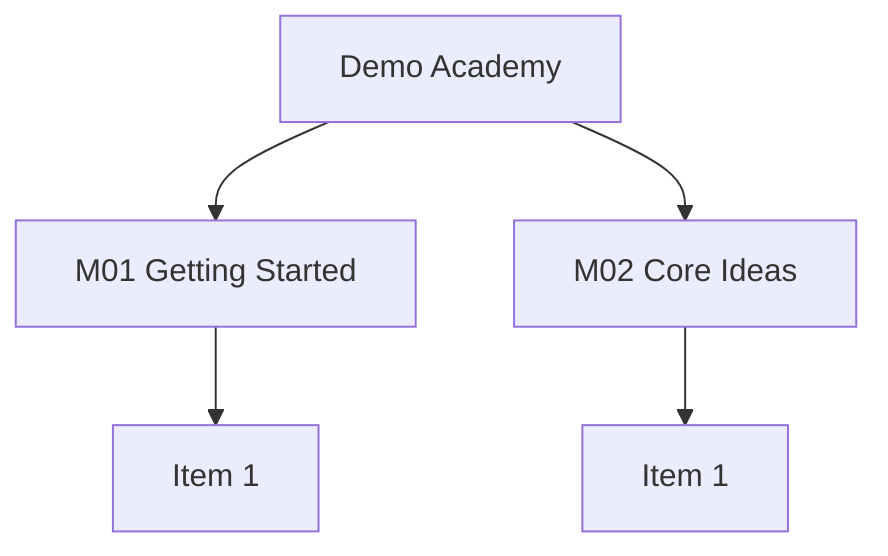

# hub-from-outline

Scaffolds any structured **outline** — course syllabus, book table of contents, training
curriculum, program calendar — into an Obsidian **hub → modules → optional dated periods**
folder for ongoing fill-in, optionally with a Mermaid outline-index graph on the hub.

Different from `/syllabus-to-knowledge-tree` (revision knowledge trees). This skill
scaffolds **operational tracking** pages updated after each session or unit.

## Vocabulary

| Canonical | Is | Typical synonyms |
|---|---|---|
| **Hub** | the durable container note | academy, program, book, discipline |
| **Track** | one instance being followed | class section, cohort, reading run, level |
| **Module** | a numbered unit of the outline | unit, chapter, part, level, workstream |
| **Item** | a leaf inside a module | lesson, section, drill, session |
| **Period** | one dated time slice | week, class day, training block, sprint |

Per-domain mappings live in [reference/domain-profiles.md](reference/domain-profiles.md).

## What It Does

- Ingests outline PDFs (text layer via `pypdf`) or pasted outlines / welcome calendars
- Creates a **Hub** (logistics + indexes) and a **Track** page (participant section)
- Adds `Modules/` stubs (default) or index-only rows (`--index-only`)
- Adds a dated period index + template when the outline is calendar-based (creates the
  **first** period note only)
- Optionally draws a **Mermaid outline-index graph** (`--mermaid`)
- Delegates Obsidian syntax to the `obsidian-markdown` skill and journal writes to
  `/log-to-journal` when those skills are available

## Workflow


## Install

```bash
git clone https://github.com/biomystery/claude-skills.git
mkdir -p ~/.claude/skills
ln -s "$(pwd)/claude-skills/hub-from-outline" ~/.claude/skills/hub-from-outline
# PDF extract helper dependency (the script installs it on demand too)
python3 -m pip install --user pypdf
```

## Usage

```bash
/hub-from-outline ~/Documents/outlines/course.pdf --dest Family/Alex/CourseName --mermaid --periods
/hub-from-outline --pasted-outline --dest Reading/Sapiens --index-only
/hub-from-outline curriculum.pdf --dest Family/Alex/Judo --period-label Block --mermaid
```

| Flag | Effect |
|---|---|
| `--mermaid` | Hub (optionally Track) Mermaid outline-index graph |
| `--periods` (alias `--weeks`) | Build a period index — on by default when the outline has dates, so pass it only to force one when dates are sparse |
| `--period-label <Week\|Day\|Block\|Sprint>` | Names the period folder and file prefix: `Week` → `Weeks/W01 …`, `Day` → `Days/D01 …` |
| `--index-only` | Do not create `Modules/Mxx` stub files |

## Output

**Sample output** (illustrative / fictional):

```
Family/Alex/Demo_Course/
├── Demo Academy.md
├── Course 101.md
├── Modules/
│   ├── _Template.md
│   ├── M01 Getting Started.md
│   └── M02 Core Ideas.md
└── Weeks/
    ├── _Template.md
    └── W01 2026-09-07.md
```

Hub Mermaid (fictional):



## Requirements

- Obsidian vault with wikilinks / callouts (Mermaid optional)
- `python3` + `pypdf` for PDF text extraction
- Optional: the `obsidian-markdown` skill for Obsidian syntax beyond the inline crib
- Optional: `/log-to-journal` when the target vault logs daily notes that way

## Supported inputs / edge cases

| Input | Handling |
|---|---|
| Text-layer PDF | `pypdf` extract → parse Modules |
| Scanned / image PDF | Script exits 2 with a per-page char report → paste or read rendered images |
| Sparse cover page selected via `--pages` | Script exits 3 naming the pages that *do* carry text, instead of misreporting the PDF as a scan |
| Garbled extract (mojibake, dropped math glyphs) | Exit 0 but unusable — treat as image-only and fall back |
| Welcome-letter calendar | Prefer dates; closures as `🚫` rows |
| "W1–W31" vs actual session count mismatch | Index by **date**; note the numbering drift on the hub |
| No dates | Modules only; skip periods |
| Only one instance will ever exist | Fold the Track into the Hub; report that it was skipped |
| Huge TOC (40+ chapters) | Mermaid collapses to Modules only (≤ ~20 nodes) |

## Skill Structure

```
hub-from-outline/
├── SKILL.md
├── README.md
├── reference/
│   ├── domain-profiles.md          # canonical vocabulary per domain
│   └── templates.md                # hub/track/module/period skeletons
└── scripts/
    └── extract_outline_text.py     # PDF text-layer extract with page report
```
