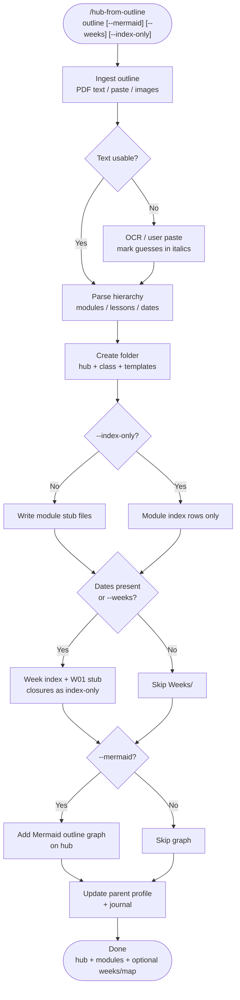
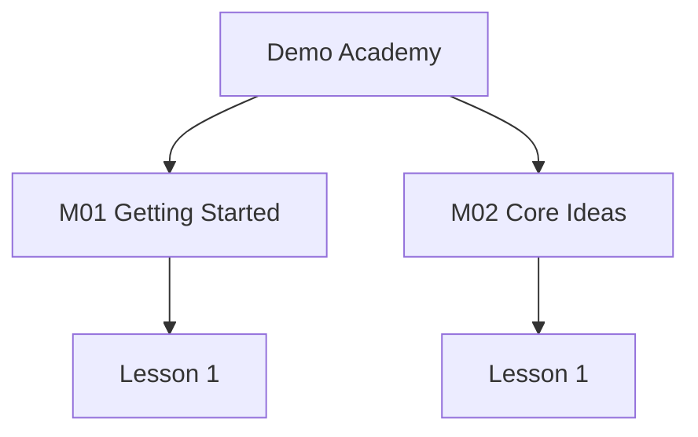

---
# hub-from-outline

Ingest a course, book, or syllabus **outline** into an Obsidian **hub → modules → optional weeks** folder for ongoing fill-in — optionally with a Mermaid outline-index graph on the hub.

Different from `/syllabus-to-knowledge-tree` (revision knowledge trees). This skill scaffolds **operational tracking** pages you update after each class or unit.

## What It Does

- Ingests outline PDFs (text layer via `pypdf`) or pasted outlines / welcome calendars
- Creates a **hub** (logistics + indexes) and a **class/course** page (student section)
- Adds `Modules/` stubs (default) or index-only rows (`--index-only`)
- Adds `Weeks/` template + date index when the outline is calendar-based (creates **W01** only)
- Optionally draws a **Mermaid outline-index graph** (`--mermaid`)
- Wires a parent person hub and logs to the daily journal when the vault uses that habit

## Workflow



## Install

```bash
git clone https://github.com/biomystery/claude-skills.git
mkdir -p ~/.claude/skills
ln -s "$(pwd)/claude-skills/hub-from-outline" ~/.claude/skills/hub-from-outline
# PDF extract helper dependency
python3 -m pip install --user pypdf
```

## Usage

```bash
/hub-from-outline ~/Documents/outlines/course.pdf --dest Family/Alex/CourseName --mermaid --weeks
/hub-from-outline --pasted-outline --dest Family/Alex/BookClub --index-only
/hub-from-outline syllabus.pdf Family/Alex/Academy_Course --mermaid
```

| Flag | Effect |
|---|---|
| `--mermaid` | Hub (optional class) Mermaid outline-index graph |
| `--weeks` | Force week index even if dates are sparse |
| `--index-only` | Do not create `Modules/Mxx` stub files |

## Output

**Sample output** (illustrative / fictional):

```
Family/Alex/Demo_Course/
├── Demo Academy.md
├── Course 101.md
├── Modules/
│   ├── _Template.md
│   ├── M01 Getting Started.md
│   └── M02 Core Ideas.md
└── Weeks/
    ├── _Template.md
    └── W01 2026-09-07.md
```

Hub Mermaid (fictional):



## Requirements

- Obsidian vault with wikilinks / callouts (Mermaid optional)
- `python3` + `pypdf` for PDF text extraction
- `/log-to-journal` when the target vault logs daily notes that way

## Supported inputs / edge cases

| Input | Handling |
|---|---|
| Text-layer PDF | `pypdf` extract → parse units |
| Scanned / image PDF | Ask for paste or read rendered page images; mark guesses |
| Welcome-letter calendar | Prefer dates; closures as `🚫` rows |
| “W1–W31” vs Sunday count mismatch | Index by **date**; note numbering drift on hub |
| No dates | Modules only; skip `Weeks/` |
| Huge TOC (40+ chapters) | Mermaid collapses to modules only (≤ ~20 nodes) |

## Skill Structure

```
hub-from-outline/
├── SKILL.md
└── README.md
```
