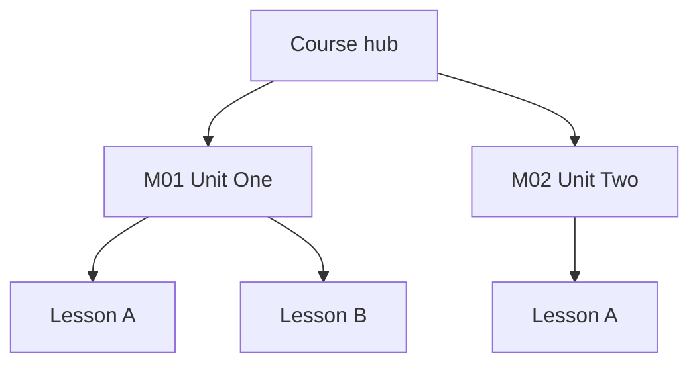

# Hub from Outline

Turns a **course / book / syllabus outline** into an Obsidian **hub → modules → (optional) weeks** folder you can fill in over time. The hub holds roster, logistics, and indexes; each module is a stub or working note; weeks are calendar fill-ins when the outline is date-based. Optionally adds a **Mermaid outline-index graph** on the hub so the hierarchy is scannable.

> Related but different: `/syllabus-to-knowledge-tree` builds a **student revision tree** (concepts by dependency, gap detection). This skill builds an **operational tracking hub** (progress logs, week notes, templates). Do not substitute one for the other.

## When to Use

- You have a syllabus PDF, book table of contents, welcome-letter calendar, or pasted outline
- You want a durable vault folder: hub + module pages + fill-in templates
- You may want a Mermaid map of units → lessons on the hub
- Examples: Chinese-school year, math academy course, book club, gym level curriculum

**Do not use** for: one-off revision notes from lesson packets (use `/syllabus-to-knowledge-tree`), or solo errands (Microsoft To Do).

## Core Rules (non-negotiable)

| Rule | Why |
|---|---|
| **Hub is kid-/cohort-agnostic where possible**; child-specific facts live on the class page | Same pattern as academy/gym hubs |
| **Prefer dates over week numbers** in indexes when both exist | Official “W1–W31” often disagrees with instructional-day counts |
| **Default: create module stub files** from outline units; `--index-only` skips stubs | Ingest should materialize structure you can open tomorrow |
| **Do not pre-create every week file** — index + `_Template` + optional W01 stub | Avoids 30 empty notes; click unresolved links to create later |
| **Mermaid is opt-in** (`--mermaid` / user asks) | Not every hub needs a graph; keep default lean |
| **Never invent unit titles** — mark guesses in *italics* until confirmed | Outline PDFs lie; covers and emails are authoritative |
| **No PII/secrets** in hubs (passwords, full account numbers, medical IDs) | Link to enrollment notes instead |
| Leave study/homework checkboxes **untagged** unless they are real agent `#task`s | Bare `- [ ]` ≠ tracked todo |
| Re-read vault files immediately before edit | iCloud/linter races |
| Log via **log-to-journal** when the vault uses that habit | Don’t reimplement journal insert |

## Instructions

### Step 0: Resolve paths and flags

```bash
VAULT="${VAULT_DIR:-$PWD}"
NOW=$(date "+%Y-%m-%dT%H:%M")
```

From the user message, capture:

| Arg | Meaning | Default |
|---|---|---|
| Outline source | PDF path, URL, or pasted text | required |
| Destination folder | e.g. `Family/<Person>/<Activity>/` | ask if missing |
| Hub filename | e.g. `Academy.md` / `SDHXCS.md` | derive from org/course name |
| Class/course filename | e.g. `CH4-1.md` / `Honors Math 4.md` | derive from course code/title |
| `--index-only` | Module index rows only, no stub files | off |
| `--mermaid` | Add outline-index Mermaid on hub (+ optional on class page) | off unless asked |
| `--weeks` | Build week index from dated outline / calendar | on if dates present |
| Parent profile | Optional `[[Person]]` hub to update | ask if obvious |

### Step 1: Ingest the outline

#### Strategy A — Local PDF with text layer

```bash
python3 - <<'PY'
import sys
from pathlib import Path
path = Path(sys.argv[1])
try:
    from pypdf import PdfReader
except ImportError:
    import subprocess
    subprocess.check_call([sys.executable, "-m", "pip", "install", "--user", "pypdf"])
    from pypdf import PdfReader
reader = PdfReader(str(path))
for i, page in enumerate(reader.pages, 1):
    text = page.extract_text() or ""
    print(f"\n--- page {i} ---\n{text}")
PY
"<path-to-outline.pdf>"
```

If text is empty/garbled → Strategy B.

#### Strategy B — Image-only / scanned PDF

Render pages (macOS `qlmanage -t`, or ask user for export) and **Read** the images, or ask the user to paste the outline. Do not invent structure from a blank extract.

#### Strategy C — Pasted outline / welcome email / journal

Use the provided text as source of truth. Prefer the latest dated welcome letter over older schedules.

Parse into a hierarchy:

```
Course / Book
└── Module | Unit | Chapter   ← becomes Modules/Mxx ….md
    └── Lesson | Section      ← listed inside the module note
Week / Date (if present)      ← becomes Weeks index rows
Closures / holidays           ← index-only 🚫 rows, no week files
```

### Step 2: Create the folder skeleton

```text
<Destination>/
├── <Hub>.md                 # org/course hub
├── <Class>.md               # this offering / section
├── Modules/
│   ├── _Template.md
│   └── M01 ….md             # unless --index-only
└── Weeks/                   # only if --weeks / dates exist
    ├── _Template.md
    └── W01 YYYY-MM-DD.md    # stub first instructional date only
```

Match existing peer folders in the destination area when the vault already uses a hub/class split (e.g. `…/<OrgOrCourse>/`).

### Step 3: Write the hub note

Frontmatter: `created`, `updated`, `tags`, `aliases`.

Required sections:

1. **What this note is** (`> [!info]`) — kid-agnostic purpose
2. **Roster / Students** — links to class pages
3. **Contact & location** (if known)
4. **Module index** — table linking to `Modules/…`
5. **How this folder is organized** — short tree + fill-in workflow
6. **Optional Mermaid** — only if `--mermaid` (see Step 6)
7. **Related** — parent profile, sibling activities

### Step 4: Write the class / course page

Required sections:

1. Snapshot callout (schedule, instructor, materials)
2. **Student/section block** (enrollment status, open todos)
3. **Module index** (same rows as hub, or finer)
4. **Week log index** if dated — Status column: `⬜` / `📝` / `✅` / `🚫`
5. Materials, teacher, logistics
6. Related links

Week index rules:

- One row per calendar session date
- Closures: `🚫` + reason, **no file**
- Instructional rows: wikilink `[[…/Weeks/Wxx YYYY-MM-DD|Wxx]]` even if file not created yet (except create **W01** stub)
- Prefer `YYYY-MM-DD` in filenames

### Step 5: Templates and stubs

**Modules/_Template.md** — scope, goals, vocab table, assignments-by-week, reflection.

**Weeks/_Template.md** — attendance, module link, class focus, homework table, teacher email, home practice, next-week link.

**Default stubs:**

- Create one module stub per outline unit (`M01 …`, `M02 …`) unless `--index-only`
- Create **only W01** week stub (first instructional date); leave later weeks as unresolved links

When filling later: duplicate the matching `_Template`, rename, flip Status on the class index.

### Step 6: Optional Mermaid outline-index graph

If the user passed `--mermaid` or asked for a graph, add a `## Map` (or `## Outline index`) section on the **hub** (and optionally the class page).

Rules:

- `flowchart TD` (or `LR` for shallow outlines)
- Nodes = modules; optional child nodes = lessons
- Keep **8–20 nodes** — collapse lessons under modules if larger
- Use stable node IDs (`M1`, `M2`, `L1a`) — labels can be human titles
- Optional: `class M1,M2 internal-link;` only when node labels match real note names Obsidian can resolve
- Do **not** put PII in node labels
- If hierarchy is uncertain, add `> [!note] Structure inferred — confirm against outline` above the diagram

Example shape (fictional):

````markdown
## Map


````

Skip Mermaid entirely when not requested.

### Step 7: Wire the parent profile (if any)

Update the person’s hub **Enrichment / activities** with a short bullet + wikilinks to class + hub (+ W01 if created). Do not dump the full outline onto the profile.

### Step 8: Journal (when vault convention applies)

Use `/log-to-journal` (or `log-to-journal/scripts/journal_insert.py`): time-first headline, details nested, link the new hub/class.

### Step 9: Report

Return:

- Folder path
- Files created
- Whether Mermaid / weeks / module stubs were included
- First fill-in action (usually W01 or M01)

## Example Invocations

```
/hub-from-outline ~/Documents/outlines/chinese-ch4-calendar.pdf --dest Family/Alex/Chinese_School --mermaid --weeks
```

```
/hub-from-outline --pasted-outline --dest Family/Alex/Math_Book --index-only
```
→ Hub + class + module index rows only; no stub files; no Mermaid

```
/hub-from-outline syllabus.pdf Family/Alex/Academy_Course --mermaid
```
→ Module stubs from units; Mermaid map; weeks only if dates appear in the PDF

## Output

```
<Dest>/
├── <Hub>.md              # indexes + optional Mermaid map
├── <Class>.md            # student section + week/module indexes
├── Modules/_Template.md
├── Modules/M01 ….md      # default on
├── Weeks/_Template.md    # if dated
└── Weeks/W01 ….md        # first session stub only
```

Plus optional parent-profile + journal links.

## Requirements

- Obsidian vault (wikilinks, callouts, optional Mermaid)
- `python3` + `pypdf` for PDF text extract (`pip install --user pypdf` if missing)
- `/log-to-journal` when logging to a Journals-style vault

## Skill Structure

```
hub-from-outline/
├── SKILL.md
└── README.md
```
