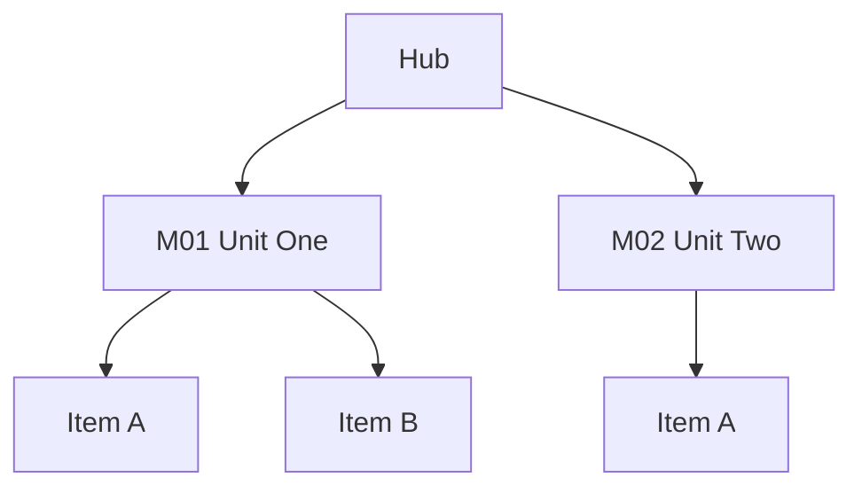

# Hub from Outline

Turns any **structured outline** into an Obsidian **hub → modules → (optional) periods**
folder to fill in over time. The hub holds logistics and indexes; each module is a stub
or working note; period notes are dated fill-ins when the outline is calendar-based.
Optionally adds a **Mermaid outline-index graph** so the hierarchy is scannable.

> Related but different: `/syllabus-to-knowledge-tree` builds a **revision tree**
> (concepts by dependency, gap detection). This skill builds an **operational tracking
> hub** (progress logs, period notes, templates). Do not substitute one for the other.

## Vocabulary

Use these five canonical terms throughout — in headings, filenames, and the report.
Domain synonyms belong in prose only; see [reference/domain-profiles.md](reference/domain-profiles.md)
for the full mapping per domain.

| Canonical | Is | Typical synonyms |
|---|---|---|
| **Hub** | the durable container note | academy, program, book, discipline |
| **Track** | one instance being followed | class section, cohort, reading run, level |
| **Module** | a numbered unit of the outline | unit, chapter, part, level, workstream |
| **Item** | a leaf inside a module | lesson, section, drill, session |
| **Period** | one dated time slice | week, class day, training block, sprint |

## When to Use

- There is a syllabus PDF, book table of contents, welcome-letter calendar, curriculum
  ladder, or pasted outline
- The goal is a durable vault folder: hub + module pages + fill-in templates
- A Mermaid map of modules → items on the hub would help
- Examples: a school year, a book club run, a gym level curriculum, a program calendar

**Do not use** for: one-off revision notes from lesson packets (use
`/syllabus-to-knowledge-tree`), goal-driven work needing next actions (use
`/project-mgr`), or solo errands (Microsoft To Do).

## Core Rules (non-negotiable)

| Rule | Why |
|---|---|
| **Hub stays instance-agnostic**; person- and run-specific facts live on the Track page | One hub survives many cohorts and years |
| **Prefer dates over sequence numbers** in indexes when both exist | Published "W1–W31" numbering routinely disagrees with actual session counts |
| **Default: create Module stub files** from outline units; `--index-only` skips them | Ingest should materialize structure that can be opened tomorrow |
| **Do not pre-create every Period file** — index + `_Template` + first stub only | Avoids 30 empty notes; click unresolved links to create later |
| **Mermaid is opt-in** (`--mermaid` / user asks) | Not every hub needs a graph; keep the default lean |
| **Never invent Module titles** — mark inferred titles in *italics* until confirmed | Outline PDFs lie; covers and emails are authoritative |
| **No PII/secrets** in these notes (passwords, full account numbers, medical IDs) | Link to the enrollment/entity note instead |
| Leave checkboxes **untagged** unless they are real agent `#task`s | Bare `- [ ]` ≠ tracked todo |
| Re-read vault files immediately before edit | iCloud/linter races |
| Delegate journal writes to `/log-to-journal` when the vault uses that habit | Don't reimplement journal insert |

## Instructions

### Step 0: Resolve paths and flags

```bash
SKILL_DIR="${SKILL_DIR:-$HOME/.claude/skills/hub-from-outline}"
VAULT="${VAULT_DIR:-$PWD}"
NOW=$(date "+%Y-%m-%dT%H:%M")
```

From the user message, capture:

| Arg | Meaning | Default |
|---|---|---|
| Outline source | PDF path, URL, or pasted text | required |
| Destination folder | e.g. `Family/<Person>/<Activity>/` | ask if missing |
| Hub filename | e.g. `Academy.md` | derive from the org/container name |
| Track filename | e.g. `CH4-1.md` / `Honors Math 4.md` | derive from the instance code/title |
| `--index-only` | Module index rows only, no stub files | off |
| `--mermaid` | Add outline-index Mermaid on hub (+ optionally the Track page) | off unless asked |
| `--periods` (alias `--weeks`) | Build a Period index from the dated outline | on if dates present |
| `--period-label <Week\|Day\|Block\|Sprint>` | Names the folder and file prefix | `Week` → `Weeks/`, `Wxx` |
| Parent profile | Optional `[[Person]]` hub to update | ask if obvious |

### Step 0.5: Syntax layer (optional delegation)

Every file written here is Obsidian Flavored Markdown. Check once:

```bash
ls "$HOME/.claude/skills/obsidian-markdown" >/dev/null 2>&1 && echo available
```

- **Available** → use `/obsidian-markdown` for any syntax decision beyond the crib
  below (property types, callout types, embed and block-reference forms). Do not
  restate its rules; invoke it.
- **Not available** → stay inside this crib, which covers everything this skill emits:

```markdown
---
created: 2026-01-01T09:00     # frontmatter properties
tags: [course, hub]
---
[[Note]] · [[Note|Alias]] · [[Modules/M01 Title|open]]   # wikilinks
![[Note#Heading]]                                        # embed a section
> [!info] Title                                          # callout (info/abstract/note)
```

Unresolved wikilinks are intentional here — clicking one creates the Period note later.

### Step 1: Ingest the outline

#### Strategy A — Local PDF with a text layer

```bash
python3 "$SKILL_DIR/scripts/extract_outline_text.py" "<path-to-outline.pdf>"
```

Add `--pages 1-4` to limit long documents. Exit code 2 means there is no usable text
layer → Strategy B.

#### Strategy B — Image-only / scanned PDF

Render pages (macOS `qlmanage -t`, or ask the user to export images) and **Read** the
images, or ask the user to paste the outline. Do not invent structure from a blank
extract.

#### Strategy C — Pasted outline / welcome email / journal

Use the provided text as the source of truth. Prefer the latest dated welcome letter
over older schedules.

Parse into this hierarchy:

```
Hub (course / book / program)
└── Module            ← becomes Modules/Mxx ….md
    └── Item          ← listed inside the module note
Period (if dated)     ← becomes Period index rows
Closures / holidays   ← index-only 🚫 rows, no file
```

### Step 2: Create the folder skeleton

```text
<Destination>/
├── <Hub>.md
├── <Track>.md
├── Modules/
│   ├── _Template.md
│   └── M01 ….md              # unless --index-only
└── Weeks/                    # <period-label>s/ — only if dates exist
    ├── _Template.md
    └── W01 YYYY-MM-DD.md     # first dated session only
```

Match existing peer folders when the vault already uses a hub/track split. If only one
instance will ever exist, fold the Track into the Hub (see domain-profiles.md) and say
so in the report.

### Step 3: Write the Hub note

Skeleton: [reference/templates.md](reference/templates.md) → *Hub note*.

Required sections, in order: purpose callout (instance-agnostic) · Tracks · contact and
location (if known) · Module index · how the folder is organized · optional Mermaid
(Step 6) · Related.

### Step 4: Write the Track note

Skeleton: [reference/templates.md](reference/templates.md) → *Track note*.

Required sections, in order: snapshot callout · participant block · Module index ·
Period index (if dated) · materials and logistics · Related.

Period index rules:

- One row per calendar session date
- Closures: `🚫` + reason, **no file**
- Live rows link `[[<Periods>/<Pxx YYYY-MM-DD>|Pxx]]` even when the file does not exist
  yet — except the first, which is created as a stub
- Always `YYYY-MM-DD` in filenames

### Step 5: Templates and stubs

Write `Modules/_Template.md` and, when dated, `<Periods>/_Template.md` from
[reference/templates.md](reference/templates.md).

Default stubs:

- One Module stub per outline unit (`M01 …`, `M02 …`) unless `--index-only`
- Only the **first** Period stub; leave later periods as unresolved links

Filling in later: duplicate the matching `_Template`, rename, flip Status on the Track
index. Status glyphs are fixed — `⬜` `📝` `✅` `🚫`, defined in templates.md.

### Step 6: Optional Mermaid outline-index graph

Only when `--mermaid` was passed or the user asked. Add a `## Map` section to the Hub
(and optionally the Track page).

Rules:

- `flowchart TD` (or `LR` for shallow outlines)
- Nodes = Modules; optional child nodes = Items
- Keep **8–20 nodes** — collapse Items under Modules when larger
- Stable node IDs (`M1`, `M2`, `L1a`); labels carry the human titles
- `class M1,M2 internal-link;` only when node labels match note names Obsidian resolves
- No PII in node labels
- If the hierarchy is uncertain, put `> [!note] Structure inferred — confirm against
  outline` above the diagram

````markdown
## Map


````

### Step 7: Wire the parent profile (if any)

Add a short bullet plus wikilinks to the Track and Hub (and the first Period, if
created) under the person's activities section. Do not dump the outline onto the profile.

### Step 8: Journal (when the vault convention applies)

Use `/log-to-journal` (or `log-to-journal/scripts/journal_insert.py`): time-first
headline, details nested, linking the new Hub and Track.

### Step 9: Report

Return: folder path · files created · whether Mermaid / periods / Module stubs were
included · whether the Track was folded into the Hub · the first fill-in action
(usually the first Period or Module).

## Example Invocations

```
/hub-from-outline ~/Documents/outlines/chinese-ch4-calendar.pdf --dest Family/Alex/Chinese_School --mermaid --periods
```
→ School profile: hub + class Track, Module stubs, dated `Weeks/` index, W01 stub, hub map

```
/hub-from-outline --pasted-outline --dest Reading/Sapiens --index-only
```
→ Book profile: hub + reading-run Track, Module index rows only, no stubs, no periods

```
/hub-from-outline curriculum.pdf --dest Family/Alex/Judo --period-label Block --mermaid
```
→ Training profile: Modules are levels, `Blocks/` instead of `Weeks/`, hub map

## Output

```
<Dest>/
├── <Hub>.md              # indexes + optional Mermaid map
├── <Track>.md            # participant block + Module/Period indexes
├── Modules/_Template.md
├── Modules/M01 ….md      # default on
├── Weeks/_Template.md    # <period-label>s/ — if dated
└── Weeks/W01 ….md        # first session stub only
```

Plus optional parent-profile and journal links.

## Requirements

- Obsidian vault (wikilinks, callouts, optional Mermaid)
- `python3`; `pypdf` for PDF text extraction — the extract script installs it with
  `pip install --user pypdf` when missing
- Optional: `/obsidian-markdown` for syntax beyond the Step 0.5 crib
- Optional: `/log-to-journal` when logging into a Journals-style vault

## Skill Structure

```
hub-from-outline/
├── SKILL.md
├── README.md
├── reference/
│   ├── domain-profiles.md          # canonical vocabulary per domain
│   └── templates.md                # hub/track/module/period skeletons
└── scripts/
    └── extract_outline_text.py     # PDF text-layer extract with page report
```
