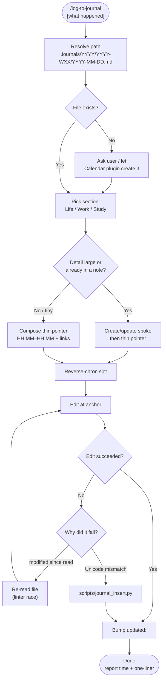

# log-to-journal

Append a **thin**, timestamped **timeline pointer** to today's Obsidian daily journal — not an archive dump. Prefer time (or start–end), a one-line outcome, and `[[wikilinks]]` to hubs/spokes that hold the detail. Handles path resolution, reverse-chronological insert, linter races, and Unicode-safe fallbacks.

## What It Does

- Resolves `Journals/YYYY/YYYY-WXX/YYYY-MM-DD.md` from today's date (Sun–Sat week; ISO week of the Monday inside the range)
- Picks the right section: `🏠 Life`, `💼 Work`, or `📖 Study`
- Formats **time-first** entries (`14:44 …` or `14:44–15:10 …`) as **one-line pointers** by default
- Links related notes; **does not restate** spoke/hub body content in the daily note
- Allows short inspiration lines without fake project structure
- Bumps frontmatter `updated:`
- Falls back to a UTF-8-safe Python inserter when `Edit` can't match a line

## Journal vs spoke (how detailed is enough?)

| Daily journal | Hub / spoke |
|---|---|
| Timeline index: who/what + outcome + links | Full background, lists, analysis, evidence |
| Optional 1 short sub-bullet (money / next step) | Anything you'd want to re-read next month |

Write the spoke first when detail must persist → then log the pointer.

## Workflow



## Install

```bash
git clone https://github.com/biomystery/claude-skills.git
ln -s "$(pwd)/claude-skills/log-to-journal" ~/.claude/skills/log-to-journal
```

Restart Claude Code — `/log-to-journal` becomes available.

## Usage

```
/log-to-journal fixed the garage door opener, replaced the worn gear
/log-to-journal booked dentist for next Tuesday
/log-to-journal            # after a task — thin pointer to notes you wrote
```

## Output

**Before (too detailed — don't):**

```markdown
- 20:10 🎒 [[April]] 4th Grade — 复盘「LEVEL UP」…
	- **背景**：…
	- **7 大规则**：L / E / V / …
	- **案卷归档**：新建 [[How to Level Up at School]] …
```

**After (thin pointer — do):**

```markdown
- 20:10 🎒 [[April]] 4th Grade — 复盘「LEVEL UP」→ [[How to Level Up at School]] · 回写 [[2026-09-13 Fourth Grade Updates]]
```

**Other thin samples:**

```markdown
## 🏠 Life

- 14:44–15:05 🛒 HD 购入新热水器 [[Home/Water Heater]] · **$1,054.87**
- 09:15 🛒 grocery run — pantry restocked
- 22:15 💡 Idea: Tue/Thu 20-min career floor before deep work
```

## Requirements

- Obsidian vault using `Journals/YYYY/YYYY-WXX/YYYY-MM-DD.md`
- `date` with `%V` ISO-week support (GNU/BSD)
- `python3` for the Unicode-safe insert fallback

## Supported inputs / edge cases

| Situation | Handling |
|---|---|
| Session just produced a long spoke | Log time + link only; body stays in the spoke |
| Inspiration with no note | 1–2 line 💡 entry; don't invent a project folder |
| Known start and end | Prefer `HH:MM–HH:MM` |
| File rewritten by linter mid-edit | Re-read, then edit |
| Unicode / CJK breaks Edit | `scripts/journal_insert.py` |
| Follow-up on an existing timestamp | Add at most one short sub-bullet — don't grow a novel |
| Daily file missing | Stop and ask |

## Skill Structure

```
log-to-journal/
├── SKILL.md
├── README.md
└── scripts/
    └── journal_insert.py
```
