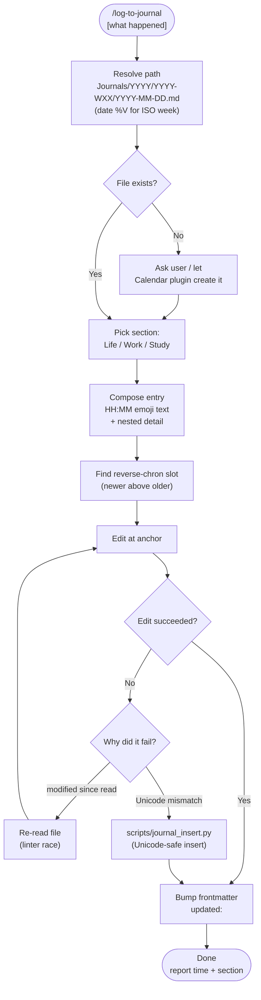

# log-to-journal

Append a timestamped entry to today's Obsidian **daily journal**, following the vault's logging conventions exactly — correct dated file path, right section, reverse-chronological order, `[[wikilinks]]`, and a bumped `updated:` stamp. Handles the two things that reliably break a naive edit: the iCloud/Obsidian linter rewriting the file mid-edit, and Unicode characters that defeat exact-string matching.

## What It Does

- Resolves `Journals/YYYY/YYYY-WXX/YYYY-MM-DD.md` from today's date (ISO week via `date %V`)
- Picks the right section: `🏠 Life`, `💼 Work`, or `📖 Study`
- Formats the entry **time-first** (`14:44 🛒 ...`) and inserts it so newer entries sit above older ones
- Links related notes/people/dates with `[[wikilinks]]`
- Bumps the frontmatter `updated:` timestamp
- Falls back to a UTF-8-safe Python inserter when the Edit tool can't match a line

## Workflow



## Install

```bash
git clone https://github.com/biomystery/claude-skills.git
ln -s "$(pwd)/claude-skills/log-to-journal" ~/.claude/skills/log-to-journal
```

Restart Claude Code — `/log-to-journal` becomes available.

## Usage

```
/log-to-journal fixed the garage door opener, replaced the worn gear
/log-to-journal booked dentist for next Tuesday
/log-to-journal            # after a task — logs what was just done
```

## Output

A single timestamped bullet inserted into today's daily note. **Sample** (illustrative):

```markdown
## 🏠 Life

- 14:30 🔧 [[Garage Door]] replaced worn drive gear, opener works again
	- part: **$18** on Amazon, 20 min install
- 09:15 🛒 grocery run — restocked pantry
```

## Requirements

- Obsidian vault using the `Journals/YYYY/YYYY-WXX/YYYY-MM-DD.md` daily-note layout
- `date` with `%V` ISO-week support (GNU/BSD both work)
- `python3` for the Unicode-safe insert fallback

## Supported inputs / edge cases

| Situation | Handling |
|---|---|
| File rewritten by linter mid-edit | Re-read, then edit |
| Line has `→ ⏳ ❌ —` / CJK / NBSP and Edit won't match | `scripts/journal_insert.py` byte-level insert |
| Entry newer than all existing | Inserted as first bullet under the section |
| No section named by user | Defaults to `🏠 Life` |
| Daily file missing | Stop and ask (Calendar plugin usually creates it) |

## Skill Structure

```
log-to-journal/
├── SKILL.md
├── README.md
└── scripts/
    └── journal_insert.py
```
