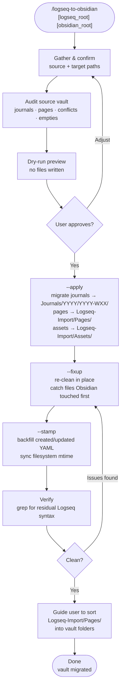

# logseq-to-obsidian

Migrate a Logseq vault into an existing Obsidian vault. Converts journal filenames, places them in the correct weekly folders, cleans all Logseq-specific syntax, converts page properties to YAML frontmatter, resolves iCloud conflict copies, skips empty files, and backfills `created`/`updated` timestamps from source file mtimes.

## What It Does

- Renames `YYYY_MM_DD.md` journals → `YYYY-MM-DD.md` and places them in `Journals/YYYY/YYYY-WXX/`
- Resolves iCloud sync conflicts (`file 2.md` duplicates) by keeping the richer file
- Skips near-empty files (Logseq empty bullets contain only `-`)
- Strips Logseq-only syntax: `collapsed::`, `:LOGBOOK:`, `TODO`/`DONE`, `blob:` images, `((block-refs))`
- Converts `[[Mon, 06/15/2023]]` date links → `[[2023-06-15]]`
- Converts page properties (`tags::`, `alias::`, `title::`) → YAML frontmatter, case-insensitively, even when Obsidian has already prepended its own YAML block
- Stages pages in `Logseq-Import/Pages/` for manual sorting
- Backfills `created`/`updated` YAML and syncs filesystem `mtime` from source files

## Workflow



## Install

```bash
git clone https://github.com/biomystery/claude-skills.git
mkdir -p ~/.claude/skills
ln -s "$(pwd)/claude-skills/logseq-to-obsidian" ~/.claude/skills/logseq-to-obsidian
```

Restart Claude Code — `/logseq-to-obsidian` will be available.

## Usage

```bash
# Interactive — prompts for paths
/logseq-to-obsidian

# With paths supplied
/logseq-to-obsidian ~/logseq-vault ~/Documents/MyVault
```

You can also run the script directly:

```bash
# Dry-run (default)
python3 scripts/logseq_migrate.py <logseq_root> <obsidian_root>

# Apply
python3 scripts/logseq_migrate.py <logseq_root> <obsidian_root> --apply

# Re-clean already-migrated files
python3 scripts/logseq_migrate.py <logseq_root> <obsidian_root> --fixup

# Backfill timestamps
python3 scripts/logseq_migrate.py <logseq_root> <obsidian_root> --stamp
```

## Output

**Sample output** (illustrative values):

```
============================================================
  Logseq → Obsidian  [APPLY]
============================================================

── Journals ──
  [OK ] journal → Journals/2022/2022-W41/2022-10-14.md
  [OK ] journal → Journals/2022/2022-W41/2022-10-15.md
  ...
  migrated=460  empty=18  exists=8  conflict_resolved=12

── Pages ──
  migrated=300  empty=38  deduped=5

── Assets ──
  copied=70

  Total: journals=460  pages=300  assets=70
  → Done. Run --fixup then --stamp next.
============================================================
```

**Resulting YAML frontmatter example (page with tags):**

```yaml
---
tags:
  - family/trips
  - travel
aliases:
  - "Christmas 2022 Trip"
created: 2022-11-15T10:30
updated: 2023-02-01T22:14
---
```

## Syntax Conversions

| Logseq | Obsidian |
|--------|---------|
| `collapsed:: true` | *(removed)* |
| `:LOGBOOK:` … `:END:` | *(removed)* |
| `- TODO task` | `- [ ] task` |
| `- DONE task` | `- [x] task` |
| `- LATER / WAITING / DOING task` | `- [ ] task` |
| `` | *(removed — dead mobile captures)* |
| `[[Mon, 06/15/2023]]` | `[[2023-06-15]]` |
| `((a1b2c3d4-…))` as sole bullet | *(line removed)* |
| `((a1b2c3d4-…))` inline in text | *(ref stripped, text kept)* |
| `tags:: #tag, [[link]], plain` | YAML `tags:` list |
| `Tags::` / `TAGS::` | same (case-insensitive) |
| `alias:: name` | YAML `aliases:` list |
| `title:: My Page` | YAML `title:` |

## Timestamp Strategy

| File | `created` | `updated` |
|------|-----------|-----------|
| Journal | Midnight of journal date (from filename) | Source `mtime` |
| Page | Source `mtime` | Source `mtime` |

`st_birthtime` is intentionally avoided — for iCloud-synced vaults it reflects the download date, not the original writing date.

## Edge Cases Handled

- **iCloud `" 2"` conflict files**: when `2023_11_17 2.md` exists alongside `2023_11_17.md`, the script keeps whichever has more meaningful content
- **YAML already prepended by Obsidian plugin**: if Obsidian's metadata plugin added `created`/`updated` before migration, the script splits the existing YAML block off, extracts Logseq properties from the body below, then re-injects them into the same YAML block — never creates a double fence
- **Capital-letter properties**: `Tags::` and `Alias::` are matched case-insensitively
- **`Date:: [[2024-02-04 Sunday]]`**: converted to `date: 2024-02-04` in YAML, ISO date extracted from wikilink
- **URL-encoded page names**: `Notes%2Findustry%2FCancerDetection.md` → `Notes - industry - CancerDetection.md`
- **ISO week boundary**: Jan 1 2023 falls in ISO week 52 of 2022 → goes in `Journals/2022/2022-W52/` (consistent with ISO year)

## Requirements

- Python 3.8+ (no third-party packages)
- Logseq vault with `journals/` folder
- Obsidian vault with existing `Journals/` folder

## Skill Structure

```
logseq-to-obsidian/
├── SKILL.md
├── README.md
└── scripts/
    └── logseq_migrate.py
```
