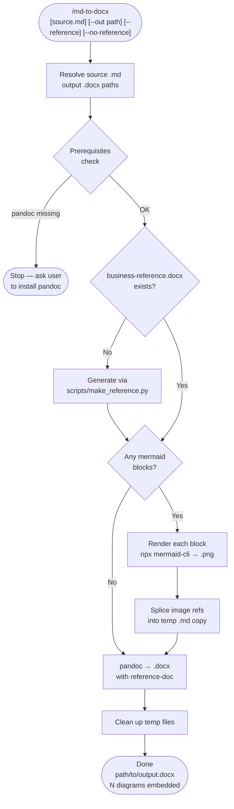

# md-to-docx

A Claude Code skill that converts a Markdown file to a Word document (`.docx`), automatically rendering Mermaid diagram code blocks as embedded PNG images and applying a clean business style (dark navy headings, styled code blocks, blue-accented blockquotes) via a bundled reference template. No global mermaid install required — uses `npx @mermaid-js/mermaid-cli` on demand.

## What It Does

- Applies a **bundled business style** (generated once on first run): dark navy headings, gray-background code blocks, blue-accented blockquotes
- Finds all ` ```mermaid ``` ` blocks and renders each to PNG via `npx @mermaid-js/mermaid-cli`
- Substitutes image references into a temporary copy of the markdown
- Runs `pandoc` to produce a `.docx` with tables, headings, bold, code blocks, and embedded diagrams
- Cleans up temp files automatically
- Supports `--reference` to override with a custom Word template, or `--no-reference` for plain pandoc output

## Bundled Business Style

The skill ships with `scripts/make_reference.py`, which generates `business-reference.docx` on first run:

| Element | Style |
| --- | --- |
| Heading 1 / 2 | Calibri Light, dark navy `#1E3A5F` |
| Heading 3 | Calibri bold, dark slate `#334155` |
| Inline code | Consolas 9.5pt, dark slate `#2D3748` |
| Fenced code blocks | Consolas 9pt, light gray `#F4F6F8` bg, gray left bar |
| Blockquotes | Calibri 10.5pt, light blue `#EBF4FD` bg, blue `#3B82F6` left bar |
| Body text | Calibri 11pt |

## Workflow



## Install

```bash
git clone https://github.com/biomystery/claude-skills.git /tmp/claude-skills
mkdir -p ~/.claude/skills
ln -s /tmp/claude-skills/md-to-docx ~/.claude/skills/md-to-docx
```

Restart Claude Code — `/md-to-docx` will be available.

## Usage

```bash
# Convert the most recently edited .md file (business style applied by default)
/md-to-docx

# Convert a specific file
/md-to-docx docs/proposal.md

# Specify output path
/md-to-docx docs/proposal.md --out reports/proposal.docx

# Override with a custom branded Word template
/md-to-docx docs/proposal.md --reference templates/company-style.docx

# Plain pandoc output, no style overrides
/md-to-docx docs/proposal.md --no-reference
```

Natural language triggers also work:

```text
convert this markdown to word
export the report to docx
make a Word version of the spec
```

## Output

| File | Description |
| --- | --- |
| `<source-stem>.docx` | Word document at the specified output path |
| `business-reference.docx` | Generated once in the skill dir; reused on all subsequent runs |
| *(temp files)* | `_mermaid_N.png`, `_tmp_pandoc_input.md` — created and deleted automatically |

**Sample output summary (illustrative):**

```text
Generated: docs/proposal.docx
  Style: business-reference.docx (default)
  Mermaid diagrams rendered: 2
  Tip: drag into Google Drive → Open with Google Docs to import as a Google Doc.
```

## Requirements

| Tool | Install | Required? |
| --- | --- | --- |
| `pandoc` | `brew install pandoc` (macOS) / `apt install pandoc` (Linux) | Yes |
| `node` / `npx` | Ships with Node.js | Yes (for Mermaid) |
| `@mermaid-js/mermaid-cli` | Fetched via `npx` automatically | Only if .md has Mermaid blocks |
| `python-docx` | Auto-installed via `pip` on first run | Only for generating reference doc |

## Edge Cases

| Situation | Behavior |
| --- | --- |
| No Mermaid blocks | Skips rendering step; runs pandoc directly |
| Mermaid render fails (one block) | Leaves that block as a fenced code block; continues |
| `npx` slow on first run | mermaid-cli is being downloaded; cached after first use |
| `--reference` provided | Uses that file instead of the bundled business reference |
| `--no-reference` passed | Skips reference doc entirely; plain pandoc default output |
| `business-reference.docx` missing | Auto-generated via `scripts/make_reference.py` before conversion |
| Multiple Mermaid blocks | Each rendered independently: `_mermaid_0.png`, `_mermaid_1.png`, … |

## Notes

- SVG output is skipped in favor of PNG — Word embeds PNG more reliably.
- To share as Google Doc: drag the `.docx` into Google Drive → right-click → *Open with Google Docs*.

## Skill Structure

```text
md-to-docx/
├── SKILL.md                 (skill definition — Claude reads and executes this)
├── README.md                (this file)
├── business-reference.docx  (generated on first run, reused thereafter)
└── scripts/
    └── make_reference.py    (generates the business reference doc)
```
