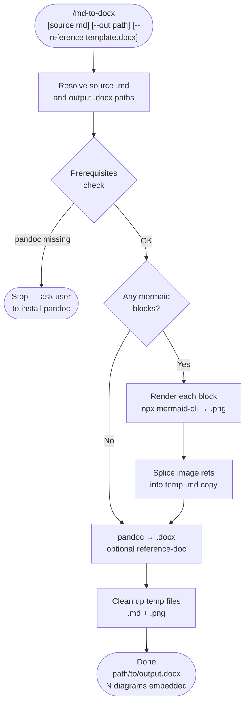

# md-to-docx

A Claude Code skill that converts a Markdown file to a Word document (`.docx`), automatically rendering any Mermaid diagram code blocks as embedded PNG images. No global mermaid install required — uses `npx @mermaid-js/mermaid-cli` on demand.

## What It Does

- Finds all ` ```mermaid ``` ` blocks in the source file and renders each to PNG via `npx @mermaid-js/mermaid-cli`
- Substitutes image references into a temporary copy of the markdown
- Runs `pandoc` to produce a `.docx` with tables, headings, bold, code blocks, and embedded diagrams
- Cleans up temp files automatically
- Supports an optional Word reference template (`--reference`) for custom fonts and styles

## Workflow



## Install

```bash
git clone https://github.com/biomystery/claude-skills.git /tmp/claude-skills
mkdir -p ~/.claude/skills
ln -s /tmp/claude-skills/md-to-docx ~/.claude/skills/md-to-docx
```

Restart Claude Code — `/md-to-docx` will be available.

## Usage

```bash
# Convert the most recently edited .md file in the working directory
/md-to-docx

# Convert a specific file (output: same dir, same name, .docx extension)
/md-to-docx docs/proposal.md

# Specify output path
/md-to-docx docs/proposal.md --out reports/proposal.docx

# Apply a branded Word template for styles/fonts
/md-to-docx docs/proposal.md --reference templates/company-style.docx
```

Natural language triggers also work:

```
convert this markdown to word
export the report to docx
make a Word version of the spec
```

## Output

| File | Description |
|---|---|
| `<source-stem>.docx` | Word document at the specified output path |
| *(temp files)* | `_mermaid_N.mmd`, `_mermaid_N.png`, `_tmp_pandoc_input.md` — created and deleted automatically |

**Sample output summary (illustrative):**
```
Generated: docs/proposal.docx
  Mermaid diagrams rendered: 2
  Tip: drag into Google Drive → Open with Google Docs to import as a Google Doc.
```

## Requirements

| Tool | Install | Required? |
|---|---|---|
| `pandoc` | `brew install pandoc` (macOS) / `apt install pandoc` (Linux) | Yes |
| `node` / `npx` | Ships with Node.js | Yes (for Mermaid) |
| `@mermaid-js/mermaid-cli` | Fetched via `npx` automatically | Only if .md has Mermaid blocks |

## Edge Cases

| Situation | Behavior |
|---|---|
| No Mermaid blocks | Skips rendering step; runs pandoc directly on source file |
| Mermaid render fails (one block) | Leaves that block as a fenced code block; continues |
| `npx` slow on first run | mermaid-cli is being downloaded; cached after first use |
| `--reference` template provided | Passed to pandoc as `--reference-doc`; applies Word styles |
| Multiple Mermaid blocks | Each rendered independently and numbered (`_mermaid_0.png`, `_mermaid_1.png`, …) |

## Notes

- SVG output is skipped in favor of PNG because Word embeds PNG more reliably.
- To share as Google Doc: drag the `.docx` into Google Drive → right-click → *Open with Google Docs*.

## Skill Structure

```
md-to-docx/
├── SKILL.md    (skill definition — Claude reads and executes this)
└── README.md   (this file)
```
