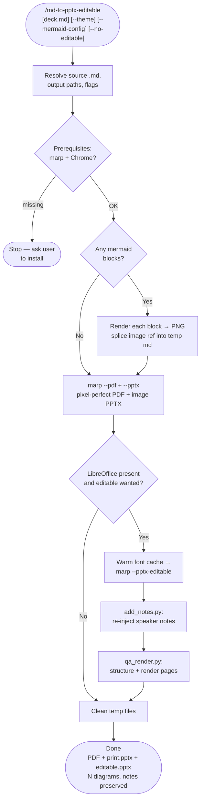

# md-to-pptx-editable

A Claude Code skill that converts a [Marp](https://marp.app) markdown deck to PowerPoint. Marp's default PPTX makes every slide a flat image you can't edit; this skill produces a **text-editable** `.pptx` via Marp's experimental `--pptx-editable` (LibreOffice) path, renders embedded Mermaid diagrams to PNG first, and re-injects the speaker-note transcripts that the editable export drops. Because the editable path can re-wrap tight layouts, it also emits a **pixel-perfect PDF and image-based PPTX** so you always have a faithful copy.

## What It Does

- Renders every ` ```mermaid ``` ` block to a PNG (via `npx @mermaid-js/mermaid-cli`, reusing system Chrome) and splices it into the slide
- Builds a **pixel-perfect PDF** and an **image-based `_print.pptx`** with Chrome (fast, faithful, notes preserved)
- Builds a **text-editable `_editable.pptx`** via `--pptx-editable` + LibreOffice
- **Re-injects Marp speaker notes** into the editable PPTX (LibreOffice drops them) by parsing the markdown's `<!-- ... -->` comments
- Warms LibreOffice's font cache to avoid a known conversion hang
- QA-renders the editable deck to PNG so you can catch LibreOffice re-wrapping before shipping
- Flags: `--theme <css>`, `--mermaid-config <json>`, `--no-editable`, `--editable-only`, `--out`

## The Editable-vs-Faithful Trade-off

`--pptx-editable` is experimental: LibreOffice sizes text boxes tightly and can re-wrap tight headings (overlap), drop the last character of styled inline labels, and flatten `box-shadow` into a gray band. So the skill hands you three artifacts and tells you which to use:

| File | Fidelity | Editable text | Notes | Use for |
| --- | --- | --- | --- | --- |
| `<base>.pdf` | Pixel-perfect | No | Yes | Presenting / submitting |
| `<base>_print.pptx` | Pixel-perfect (images) | No | Yes | When `.pptx` is required and looks must match |
| `<base>_editable.pptx` | Approximate | Yes | Yes | Editing wording in PowerPoint |

Keep your Marp theme loose (generous heading sizes, no blur/pill chips) if the editable file is the one that matters.

## Workflow



## Install

```bash
git clone https://github.com/biomystery/claude-skills.git /tmp/claude-skills
mkdir -p ~/.claude/skills
ln -s /tmp/claude-skills/md-to-pptx-editable ~/.claude/skills/md-to-pptx-editable
```

Restart Claude Code — `/md-to-pptx-editable` will be available.

## Usage

```bash
# Convert the most recently edited .md (all three outputs)
/md-to-pptx-editable

# A specific deck
/md-to-pptx-editable slides.md

# With a custom Marp theme and Mermaid theme config
/md-to-pptx-editable deck.md --theme clinical.css --mermaid-config mermaid.json

# Choose an output base; only the pixel-perfect outputs
/md-to-pptx-editable deck.md --out build/deck.pptx --no-editable
```

Natural language also works:

```text
convert this marp deck to an editable powerpoint
make a pptx from slides.md with the diagrams as images
```

## Output

**Sample report** (illustrative values):

```
deck_editable.pptx: 6 slides
  slide 1: text_boxes=5 pictures=0 note_chars=210
  slide 2: text_boxes=9 pictures=0 note_chars=540
  slide 3: text_boxes=3 pictures=1 note_chars=480
  ...
Embedded 2 diagrams · notes preserved on 6/6 slides
Files: deck.pdf · deck_print.pptx · deck_editable.pptx
```

## Requirements

| Tool | Install | Purpose |
| --- | --- | --- |
| `@marp-team/marp-cli` | `npm i -g @marp-team/marp-cli` | Markdown → PDF / PPTX |
| Chrome / Chromium | system install | Marp + Mermaid rendering |
| LibreOffice | cask, or direct DMG | Editable PPTX export only |
| `@mermaid-js/mermaid-cli` | auto via `npx` | Renders Mermaid blocks |
| `python-pptx`, `pymupdf` | auto into `.venv` | Notes injection + QA render |

## Supported Inputs / Edge Cases

- **No Mermaid blocks** — skips rendering, converts directly.
- **No LibreOffice** — emits only the PDF + image PPTX and says so.
- **Mermaid render fails** — leaves that block as code and warns; other slides still convert.
- **Slide/notes count mismatch** — pairs the first N in order and warns.
- **Directive comments** (`_class:`, `paginate:`, `_header:`) — correctly excluded from notes.
- **Font-cache hang** — pre-warmed; recovery steps documented if it still stalls.

## Skill Structure

```
md-to-pptx-editable/
├── SKILL.md
├── README.md
└── scripts/
    ├── render_mermaid.py   (extract + render Mermaid fences to PNG)
    ├── add_notes.py        (re-inject Marp speaker notes into the editable PPTX)
    └── qa_render.py        (structure report + PPTX→PNG render for visual QA)
```
