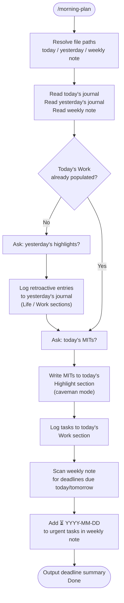

# morning-plan

A Claude Code skill that runs the full morning planning loop for an Obsidian vault. It reads the weekly note and recent daily journals, prompts the user for yesterday's highlights and today's work tasks, logs everything to the right dated files, schedules urgent todos using the Obsidian Tasks `⏳` syntax, and surfaces any imminent deadlines — all in one shot.

## What It Does

- Reads yesterday's journal and fills in retroactive entries (completions, calls, life events)
- Populates today's journal Highlight section with caveman-mode MITs (2–3 bullets)
- Logs today's tasks to the Work section with a timestamp and checkboxes
- Adds `⏳ YYYY-MM-DD` to urgent tasks in the **weekly note** so they surface in today's Scheduled section automatically
- Outputs a deadline summary for anything due today or tomorrow

## Workflow



## Install

Add to your Claude Code project settings or `CLAUDE.md`:

```
Skills repo: https://github.com/biomystery/claude-skills
```

Or invoke directly via `/morning-plan` if the skill is registered.

## Usage

```
/morning-plan
```

Claude will ask for yesterday's highlights and today's tasks, then handle all logging automatically.

You can also front-load both answers in one message:

```
/morning-plan
昨天：team meeting, helped family member with errand, watched the game
今天：1) data analysis task  2) prepare summary deck
```

## Output

**Sample output** (illustrative values):

```
Today's MITs:
1. Alice — review parameter ranges for QC report
2. Prepare summary deck for team review

⚠️ Deadlines:
- Contract renewal decision — due tomorrow
```

Files modified:
- `Journals/2026/2026-W20/2026-05-18.md` — retroactive entries added
- `Journals/2026/2026-W20/2026-05-19.md` — MITs + Work section populated
- `Journals/2026/2026-W20.md` — `⏳` added to 2 urgent tasks

## Requirements

- Obsidian vault with daily notes at `Journals/YYYY/YYYY-WXX/YYYY-MM-DD.md`
- Weekly notes at `Journals/YYYY/YYYY-WXX.md`
- [Obsidian Tasks plugin](https://github.com/obsidian-tasks-group/obsidian-tasks) — for `⏳` scheduled-date queries
- `CLAUDE.md` in vault root with section names, emoji conventions, wikilink style

## Supported Inputs / Edge Cases

| Situation | Handling |
|---|---|
| User front-loads yesterday + today in one message | Claude skips prompts, logs directly |
| Yesterday's journal already has entries | Adds missing items only; does not duplicate |
| Weekly note task already has `⏳` | Skips — does not add a duplicate date |
| iCloud linter modifies file between read and edit | Always re-reads immediately before each Edit call |
| Yesterday spans a different ISO week | Resolves `YYYY-WXX` independently for each date |
| Today's Work section already populated | Skips MIT-setting step, goes straight to scheduling |

## Skill Structure

```
morning-plan/
├── SKILL.md
└── README.md
```
