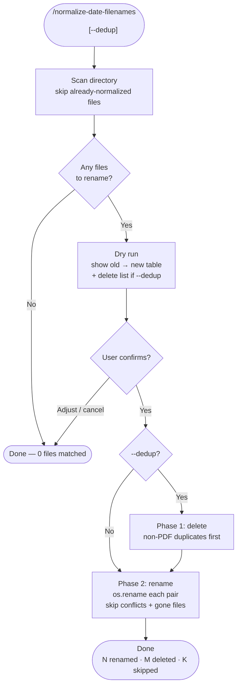

# normalize-date-filenames

A Claude Code skill that normalizes dated filenames to a consistent `YYYY-MM-DD-<suffix>.ext` format. Handles every naming style produced by Office Lens, Microsoft Lens, iPhone "Scan from", and manual compact-date conventions. Dry-runs first, requires explicit confirmation, and can optionally delete `.pptx`/`.docx` duplicates when a `.pdf` of the same scan already exists.

## What It Does

- Parses 13+ distinct date-in-filename formats (see table below)
- Strips app-name tokens ("Office Lens", "Microsoft Lens", "Scan from")
- Keeps time and AM/PM suffix as-is for disambiguation; keeps user-provided descriptions
- Detects and removes `.pptx`/`.docx` duplicates when a `.pdf` counterpart exists (`--dedup`)
- Skips already-normalized files (`YYYY-MM-DD-…`) and files with no recognisable date

## Workflow



## Install

```bash
git clone https://github.com/biomystery/claude-skills.git
mkdir -p ~/.claude/skills
ln -s "$(pwd)/claude-skills/normalize-date-filenames" ~/.claude/skills/normalize-date-filenames
```

Restart Claude Code — `/normalize-date-filenames` will be available.

## Usage

```bash
# Rename all dated files to YYYY-MM-DD format (dry-run shown first)
/normalize-date-filenames ~/Documents/scans

# Also delete .pptx/.docx when a .pdf of the same scan exists
/normalize-date-filenames ~/Documents/scans --dedup
```

## Supported Date Formats

| Input format | Example input | Output name |
|---|---|---|
| `Scan from YYYY-MM-DD HH_MM_SS AM/PM` | `Scan from 2025-12-24 02_32_58 PM.pdf` | `2025-12-24-02-32-58-PM.pdf` |
| `YYYY-MM-DD HH_MM_SS AM/PM[-desc]` | `2025-08-24 10_56_34 AM-april-card.pdf` | `2025-08-24-10-56-34-AM-april-card.pdf` |
| `YYYYMMDD-HHMMSS Office Lens` | `20150930-040704 Office Lens.pdf` | `2015-09-30-040704.pdf` |
| `Office Lens YYYYMMDD-HHMMSS` | `Office Lens 20170625-213256.pdf` | `2017-06-25-213256.pdf` |
| `MMDDYYYY HHH(H) AM/PM [Lens] [N]` | `11272015 213 PM Office Lens 2.pptx` | `2015-11-27-213-PM-2.pptx` |
| `MDDYYYY HHH(H) AM/PM [Lens]` | `1242015 1023 PM Office Lens.pptx` | `2015-01-24-1023-PM.pptx` |
| `MDYYYY HHH(H) AM/PM [Lens]` | `142016 726 AM Office Lens.pptx` | `2016-01-04-726-AM.pptx` |
| `MMDDYY[,] HHH(H) AM/PM [Lens]` | `102220, 225 PM Office Lens.pdf` | `2020-10-22-225-PM.pdf` |
| `MDDYY HHH(H) AM/PM [Lens] [N]` | `81516 621 PM Office Lens 1.pdf` | `2016-08-15-621-PM-1.pdf` |
| `MDYY HHH(H) AM/PM [Lens]` | `6916 1037 AM Office Lens.pdf` | `2016-06-09-1037-AM.pdf` |
| `M_DD_YY, H_MM AM/PM Microsoft Lens` | `1_11_23, 8_06 AM Microsoft Lens.pdf` | `2023-01-11-8-06-AM.pdf` |
| `YYMMDD_desc` | `190803_receipt.pdf` | `2019-08-03-receipt.pdf` |
| `Desc_YYYYMMDD[ N]` | `Aiden_bill_20201215.pdf` | `2020-12-15-Aiden-bill.pdf` |

## Output

**Sample dry-run output** (illustrative values):

```
=== RENAMES ===
  'Scan from 2025-12-24 02_32_58 PM.pdf'    → '2025-12-24-02-32-58-PM.pdf'
  '20150930-040704 Office Lens.pdf'          → '2015-09-30-040704.pdf'
  '81516 621 PM Office Lens 1.pdf'           → '2016-08-15-621-PM-1.pdf'
  'Aiden_bill_20201215.pdf'                  → '2020-12-15-Aiden-bill.pdf'

=== DELETE (non-PDF duplicates) ===
  '20150930-040704 Office Lens.docx'
  '20150930-040704 Office Lens.pptx'

Summary: 4 renames, 2 deletable
```

**After confirmation:**

```
DELETED  '20150930-040704 Office Lens.docx'
DELETED  '20150930-040704 Office Lens.pptx'
RENAMED  'Scan from 2025-12-24 02_32_58 PM.pdf' → '2025-12-24-02-32-58-PM.pdf'
RENAMED  '20150930-040704 Office Lens.pdf'       → '2015-09-30-040704.pdf'
...
Done. Renamed: 4, Deleted: 2, Skipped: 2
```

> Note: "SKIP (already gone)" entries during rename phase are expected when `--dedup` deleted the file first — not errors.

## Requirements

- Python 3 (standard library only)
- Write permission to the target directory

## Key Design Decisions

**Time kept in original format, not converted to 24h.** `11272015 213 PM Office Lens 2` → `2015-11-27-213-PM-2`, not `2015-11-27-14-13-2`. Keeps the suffix readable and avoids AM/PM conversion bugs.

**Delete before rename.** Phase 1 removes `.pptx`/`.docx` duplicates while their original names are still intact. Phase 2 then renames the surviving files. The "SKIP (already gone)" log lines from Phase 2 are a normal side-effect.

**Year sanity check (2000–2035).** Prevents compact date strings from being mis-parsed as ancient years (e.g. `MDYYYY` misparsed to year 803).

**Unicode whitespace normalisation.** Newer Microsoft Lens files use narrow no-break space (U+202F) between time and AM/PM. The `ns()` helper converts all Unicode space variants before parsing.

## Skill Structure

```
normalize-date-filenames/
├── SKILL.md    (instruction file Claude executes)
└── README.md   (this file)
```
