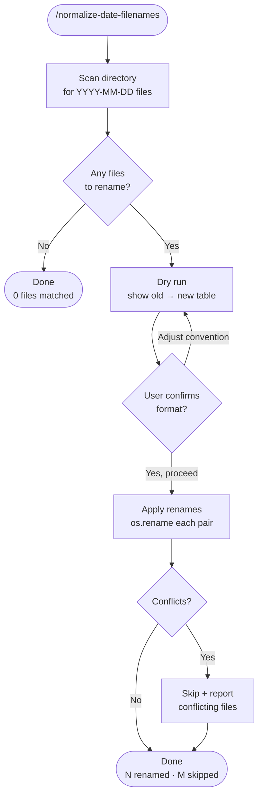

# normalize-date-filenames

A Claude Code skill that normalizes filenames starting with `YYYY-MM-DD` to a consistent format: all hyphens, no underscores, no trailing spaces. Dry-runs first and requires explicit user confirmation before renaming anything.

## What It Does

- Scans a directory for files matching `YYYY-MM-DD[-_]` prefix
- Computes target names: one separator style throughout, trailing spaces stripped
- Presents a full old→new table for review before touching any file
- Skips conflicts (target name already exists) and reports them

## Workflow



## Install

```bash
git clone https://github.com/biomystery/claude-skills.git
mkdir -p ~/.claude/skills
ln -s "$(pwd)/claude-skills/normalize-date-filenames" ~/.claude/skills/normalize-date-filenames
```

Restart Claude Code — `/normalize-date-filenames` will be available.

## Usage

```bash
# Normalize all dated files in a folder (all hyphens, no underscores)
/normalize-date-filenames ~/Documents/scans

# Limit to a specific extension
/normalize-date-filenames ~/Documents/scans --ext .pdf
```

## Output

Files renamed in-place. No files created or deleted.

**Sample dry-run output** (illustrative values):

```
  '2022-06-26_car_service_receipt.pdf'  → '2022-06-26-car-service-receipt.pdf'
  '2023-04-01-invoice .pdf'             → '2023-04-01-invoice.pdf'
  '2024-05-21-honda-invoice .pdf'       → '2024-05-21-honda-invoice.pdf'

Total: 3 files to rename
```

**After confirmation:**

```
OK: '2022-06-26_car_service_receipt.pdf' → '2022-06-26-car-service-receipt.pdf'
OK: '2023-04-01-invoice .pdf'            → '2023-04-01-invoice.pdf'
OK: '2024-05-21-honda-invoice .pdf'      → '2024-05-21-honda-invoice.pdf'

Done. 3 renamed, 0 skipped.
```

## Requirements

- Python 3 (standard library only)
- Write permission to the target directory

## Supported Inputs / Edge Cases

| Case | Behavior |
|---|---|
| Mixed `_` and `-` separators in same folder | Both matched and normalized in one pass |
| Trailing space before extension (`file .pdf`) | Space stripped automatically |
| Unicode / CJK characters in filename | Handled correctly by Python `os.rename` |
| Target name already exists | Skipped and reported; no overwrite |
| Files not matching `YYYY-MM-DD` prefix | Ignored entirely |
| User changes separator convention mid-review | Re-dry-run with new rule before applying |

## Skill Structure

```
normalize-date-filenames/
├── SKILL.md    (instruction file Claude executes)
└── README.md   (this file)
```
