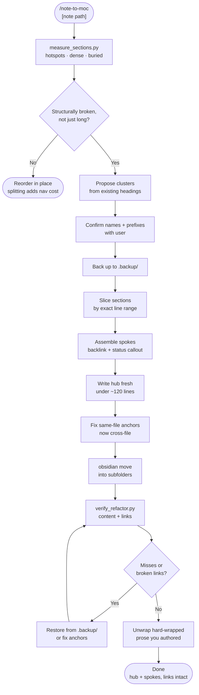

# note-to-moc

Rescues an Obsidian note that has outgrown itself. Splits one overgrown note into a compact
**MOC hub** plus **spoke notes** grouped into subfolders, extracting every section by exact
line range so verbatim content is never retyped, moving files through the Obsidian CLI so
inbound links rewrite themselves, and verifying afterwards that nothing was lost and no link
was broken.

Built for the note that has been accumulating for months — a long-running project, a dispute,
a research thread, a medical or legal matter — where the current status has sunk to the bottom
and three parallel threads are interleaved by date.

## What It Does

- **Diagnoses first, splits second** — reports hotspots, mega-bullet density, and a buried
  status heading, so the split answers the actual problem rather than the line count
- **Derives the folder structure from the note's own shape** instead of imposing a taxonomy
- **Slices by line range** — quoted correspondence, transcripts and legal text arrive byte-identical
- **Writes only the hub fresh** — status, next actions, thread table, map, standing facts
- **Moves via `obsidian move`** so Obsidian rewrites every inbound link vault-wide
- **Verifies twice** — every substantive original line still exists; every wikilink and heading anchor resolves
- **Fixes the Obsidian line-break trap** — single newlines render as `<br>`, so hard-wrapped prose breaks mid-sentence
- **Preserves superseded notes** with a banner and a was-here → now-here pointer table

## Workflow



## Install

```bash
git clone https://github.com/biomystery/claude-skills.git
mkdir -p ~/.claude/skills
ln -s "$PWD/claude-skills/note-to-moc" ~/.claude/skills/note-to-moc
```

## Usage

```bash
# Full refactor — diagnose, propose, split, move, verify
/note-to-moc Projects/Doing/long-running-matter/Everything.md

# Diagnosis only — prints the report and a proposed split, writes nothing
/note-to-moc --diagnose-only Research/Literature.md
```

Or run the scripts directly:

```bash
python3 scripts/measure_sections.py "Notes/BigNote.md"

python3 scripts/verify_refactor.py \
  --original "Notes/.backup/BigNote.md" \
  --new-dir  "Notes" \
  --vault    "$HOME/Documents/MyVault"
```

## Output

```
long-running-matter/
├── Overview.md              ← MOC hub: status · next actions · map
├── Foundation/
│   ├── Background.md
│   └── Reference Data.md
├── Threads/
│   ├── Thread 1 - Vendor.md
│   ├── Thread 2 - Internal.md
│   └── Thread 3 - Regulator.md
├── Decisions/
│   ├── Decision Log.md
│   └── Draft Correspondence.md
├── Archive/
│   └── Superseded Plan.md
└── .backup/                 ← every touched file, pre-refactor
```

**Sample output** (illustrative values):

```
TOTAL: 640 lines, 74.0 KB

L  120   99 lines   14.5 KB  ## Thread 2 — Internal Escalation
L  480   65 lines    9.0 KB  ### Response analysis
L  590   19 lines    4.2 KB  ## Status

  HOTSPOT  L120: 14.5 KB - split candidate: ## Thread 2 — Internal Escalation
  DENSE    L300: 410 B/line - mega-bullets: ### Root Cause
  BURIED   L590: status-like heading past the halfway mark: ## Status

--- after refactor ---
CONTENT - checking 1 original(s) against 9 new file(s)
  BigNote.md: 12 line(s) not found verbatim     ← all confirmed intentional rewrites

LINKS - 47 wikilink(s) checked
  broken links : 0
  bad anchors  : 0
RESULT: links OK
```

## Requirements

- **Python 3** — slicing and verification
- **Obsidian CLI** with the app running — link-preserving moves
  (optional: move inside the app instead; never use `mv`)
- An Obsidian vault

## Supported inputs / edge cases

| Case | Behaviour |
|---|---|
| Note under ~300 lines | Recommends reordering in place — splitting costs more than it saves |
| Bulk is one indivisible document | Leaves it whole, gives it a hub neighbour |
| Sibling notes with competing status sections | Merges unique content, adds a superseded banner and pointer table |
| Same-file `[[#Anchor]]` links | Rewritten to `[[Note#Anchor]]` after the split |
| Escaped pipes `\|` in table wikilinks | Handled — trailing `\` stripped before anchor comparison |
| iCloud / OneDrive-backed vault | Avoids vault-wide `grep -r`, which hangs; uses a skip-listed walk |
| `--vault` pointed at the wrong folder | Warns when `.obsidian/` is absent, before reporting false broken links |
| Obsidian linter reformatting mid-edit | Documented — re-read and use regex replace |

## Skill Structure

```
note-to-moc/
├── SKILL.md
├── README.md
└── scripts/
    ├── measure_sections.py
    └── verify_refactor.py
```
