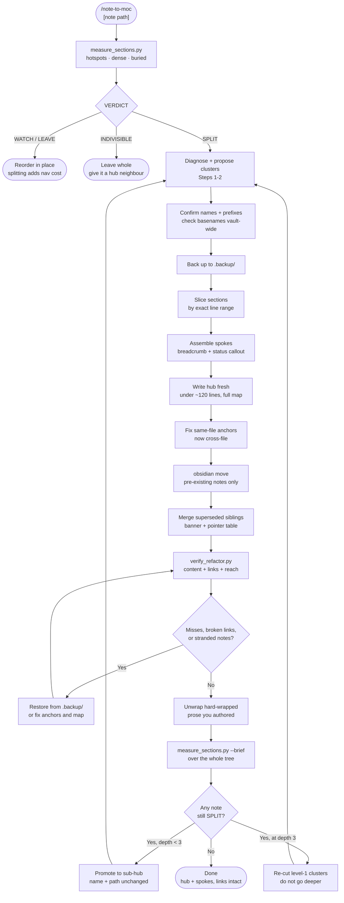

# note-to-moc

Rescues an Obsidian note that has outgrown itself. Splits one overgrown note into a compact
**MOC hub** plus **spoke notes** grouped into subfolders, extracting every section by exact
line range so verbatim content is never retyped, moving files through the Obsidian CLI so
inbound links rewrite themselves, and verifying afterwards that nothing was lost, no link was
broken, and no note was stranded. When a spoke is itself still too big, the same process runs
on it and it becomes a **sub-hub** — recursion with a mechanical stopping rule and a depth
ceiling of three.

Built for the note that has been accumulating for months — a long-running project, a dispute,
a research thread, a medical or legal matter — where the current status has sunk to the bottom
and three parallel threads are interleaved by date.

## What It Does

- **Diagnoses first, splits second** — reports hotspots, mega-bullet density, and a buried
  status heading, then a `SPLIT` / `INDIVISIBLE` / `UNSTRUCTURED` / `WATCH` / `LEAVE`
  verdict, so the split answers the actual problem rather than the line count
- **Derives the folder structure from the note's own shape** instead of imposing a taxonomy
- **Slices by line range** — quoted correspondence, transcripts and legal text arrive byte-identical
- **Writes only hubs fresh** — status, next actions, thread table, map, standing facts
- **Recurses into spokes that are still overgrown** — a spoke keeps its name and path when it
  becomes a sub-hub, so every inbound link survives untouched; its children are wired into the
  root hub's map so the root stays the single entry point
- **Stops on its own** — recursion ends when every note reports `WATCH`, `LEAVE` or
  `INDIVISIBLE`; a `SPLIT` at depth 3 is treated as evidence the top-level clusters were wrong,
  not as licence to add a fourth level
- **Moves via the Obsidian CLI** (`obsidian move`) so Obsidian rewrites every inbound link vault-wide — `mv` would silently break them all
- **Verifies four ways** — every substantive original line still exists (with a *compared*
  count, so a check that silently ran on nothing cannot read as a pass); every wikilink and
  heading anchor in the new notes resolves; every link **from the rest of the vault** into
  the refactored notes still resolves; every note is reachable from the hub and listed in
  its map
- **Fixes the Obsidian line-break trap** — single newlines render as `<br>`, so hard-wrapped prose breaks mid-sentence
- **Preserves superseded notes** with a banner and a was-here → now-here pointer table

## Workflow



## Install

```bash
git clone https://github.com/biomystery/claude-skills.git
mkdir -p ~/.claude/skills
ln -s "$PWD/claude-skills/note-to-moc" ~/.claude/skills/note-to-moc
```

## Usage

```bash
# Full refactor — diagnose, propose, split, move, verify, then recurse
/note-to-moc Projects/Doing/long-running-matter/Everything.md

# Diagnosis only — prints the report and a proposed split, writes nothing
/note-to-moc --diagnose-only Research/Literature.md

# One level only — reports which spokes would have been promoted, and stops
/note-to-moc --no-recurse Projects/Doing/long-running-matter/Everything.md
```

Or run the scripts directly:

```bash
# Diagnose one note, or scan a whole tree of spokes for promotion candidates
python3 scripts/measure_sections.py "Notes/BigNote.md"
find Notes -name '*.md' -not -path '*/.backup/*' -print0 \
  | xargs -0 python3 scripts/measure_sections.py --brief

python3 scripts/verify_refactor.py \
  --original "Notes/.backup/BigNote.md" \
  --new-dir  "Notes" \
  --vault    "$HOME/Documents/MyVault" \
  --hub      "Notes/Overview.md"
```

`--new-dir` is walked recursively, so one run verifies every level of the tree at once. Pass
only the *root* backup to `--original`: per-level backups are undo, not evidence.

## Output

```
long-running-matter/
├── Overview.md                      ← MOC hub: status · next actions · full map
├── Foundation/
│   ├── Background.md
│   └── Reference Data.md
├── Threads/
│   ├── Thread 1 - Vendor.md          ← promoted to a sub-hub (name and path unchanged)
│   ├── Thread 1 - Vendor/            ← its own spokes, one level down
│   │   ├── Vendor - Timeline.md
│   │   └── Vendor - Correspondence.md
│   ├── Thread 2 - Internal.md
│   └── Thread 3 - Regulator.md
├── Decisions/
│   ├── Decision Log.md
│   └── Draft Correspondence.md
├── Archive/
│   └── Superseded Plan.md
└── .backup/                          ← every touched file, pre-refactor, mirroring the tree
    ├── BigNote.md
    └── Threads/
        └── Thread 1 - Vendor.md
```

**Sample output** (illustrative values):

```
TOTAL: 640 lines, 74.0 KB, 7 top-level section(s)

L  120   99 lines   14.5 KB  ## Thread 2 — Internal Escalation
L  480   65 lines    9.0 KB  ### Response analysis
L  590   19 lines    4.2 KB  ## Status

  HOTSPOT  L120: 14.5 KB - split candidate: ## Thread 2 — Internal Escalation
  DENSE    L300: 410 B/line - mega-bullets: ### Root Cause
  BURIED   L590: status-like heading past the halfway mark: ## Status

VERDICT: SPLIT - 640 lines across 7 top-level sections

--- recursion check ---
SPLIT        Threads/Thread 1 - Vendor.md  (431 lines across 5 top-level sections)
INDIVISIBLE  Archive/Master Agreement.md   (512 lines but only 1 top-level section - ...)
LEAVE        Foundation/Background.md      (88 lines - healthy)

--- after refactor ---
CONTENT - checking 1 original(s) against 11 new file(s)
  (lines shorter than 10 chars are not compared; headings are compared separately)

  BigNote.md: 604 line(s) compared, 12 not found   ← all confirmed intentional rewrites

LINKS - 63 wikilink(s) checked in the refactored notes
  broken links : 0
  ambiguous    : 0  (warning - Obsidian picks the nearest)
  bad anchors  : 0

INBOUND - 4 link(s) from the rest of the vault into the refactored notes
  broken links : 0
  bad anchors  : 1
     Journal/2026-06-14.md -> [[BigNote#Vendor decision]]  (heading gone - it moved to a spoke)

REACH - 11 note(s) under long-running-matter, 11 reachable from the hub
  unreachable  : 0
  not in map   : 0  (warning - hub's map should list every note)
RESULT: ERRORS - fix before continuing
```

## Requirements

- **Python 3** — slicing and verification
- **Obsidian CLI** with the app running — link-preserving moves and renames
  (see the `obsidian-cli` skill). Optional only if you move files inside the app
  instead; `mv` is never an acceptable substitute.
- An Obsidian vault

## Supported inputs / edge cases

| Case | Behaviour |
|---|---|
| Note under ~300 lines | `LEAVE`/`WATCH` — recommends reordering in place; splitting costs more than it saves |
| Bulk is one indivisible document | `INDIVISIBLE` — left whole, given a hub neighbour |
| A spoke that is still too big after the split | Promoted to a sub-hub in place; name and path unchanged, so inbound links survive |
| Recursion that will not terminate | Depth 3 is the ceiling; a `SPLIT` there is reported as a level-1 clustering error instead |
| Sibling notes with competing status sections | Merges unique content, adds a superseded banner and pointer table |
| Same-file `[[#Anchor]]` links | Rewritten to `[[Note#Anchor]]` after the split; checked against the containing file |
| `[[folder/Note]]` relative to the linking file | Resolved the way Obsidian resolves it — vault-root path, then source-folder-relative, then basename |
| Two notes sharing a basename | Reported as `ambiguous` with both candidates, as a warning — Obsidian picks the nearest |
| A note nothing links to | `REACH` reports it as unreachable; bytes surviving is not the same as being findable |
| A note reachable only via a sub-hub, missing from the root map | `not in map` warning — `REACH` alone cannot see this, because reachability is transitive |
| A link from elsewhere in the vault into the refactored notes | `INBOUND` re-resolves it, including its heading anchor; pre-existing breakage elsewhere in the vault is not reported |
| Links inside code fences, backticks or `%%comments%%` | Ignored — they create no backlink in Obsidian, and counting them made stranded notes look reachable |
| An empty, truncated, or unterminated-frontmatter backup | `CONTENT` prints a compared-line count and fails when it is zero, instead of reporting "0 not found" |
| A note sectioned with `#` rather than `##` | Top level is the shallowest depth carrying ≥3 headings, so it is not misreported as `INDIVISIBLE` |
| A big note with no headings at all | `UNSTRUCTURED` — no split can be proposed; it is not silently called indivisible |
| An unterminated code fence | Masks nothing, rather than blanking the rest of the file and hiding every section and link after it |
| A path-qualified link that matches nothing (`[[../Note]]`, `[[stale/path/Note]]`) | Reported broken; no basename fallback, which used to resolve it to a different note |
| A bare `#tag` at column 0 | Not treated as a heading, so `[[Note#tag]]` no longer validates against it |
| Non-UTF-8 note in a sweep | Decoded leniently; one bad file no longer aborts the rest of the run |
| Block references `[[Note#^abc123]]` | Skipped by the anchor check — a block ref is not a heading |
| Headings inside fenced code blocks | Masked, so a `## Status` in a bash example is neither a section nor an anchor |
| Callout title used as an anchor | Reported as a bad anchor — a callout title is not a heading |
| Escaped pipes `\|` in table wikilinks | Handled — trailing `\` stripped before anchor comparison |
| iCloud / OneDrive-backed vault | Avoids vault-wide `grep -r`, which hangs; uses a skip-listed walk |
| Moving a whole folder | `obsidian move` rejects folders (files only) — destination folders are `mkdir`'d and notes moved individually; folder moves go through the app |
| Newly created spokes | Written straight into their folder — no move and no link rewriting needed, since nothing links to them yet |
| Multi-file move loop | Every `obsidian` call gets `</dev/null`; the CLI otherwise eats the loop's stdin and only the first move runs |
| `--vault` pointed at the wrong folder | Warns when `.obsidian/` is absent, before reporting false broken links |
| Missing or mistyped `--original` backup | Fails loudly rather than passing vacuously on an empty content check |
| Obsidian linter reformatting mid-edit | Documented — re-read and use regex replace |

## Skill Structure

```
note-to-moc/
├── SKILL.md
├── README.md
└── scripts/
    ├── measure_sections.py   # diagnose + VERDICT; drives the recursion stopping rule
    └── verify_refactor.py    # content-loss, link, and reachability checks
```
