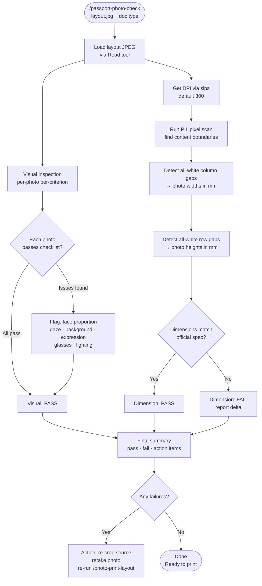

# passport-photo-check

A Claude Code skill that verifies every individual photo in a print-lab layout JPEG meets official ID/passport requirements. Given a 4×6 (or other) tiled layout, it runs both a visual compliance check (face proportion, expression, background, gaze) and a precise pixel-level dimension measurement. Pairs with `/photo-print-layout`, which produces the layout file this skill checks.

## What It Does

- Loads the layout JPEG and visually inspects each photo against the target document's official checklist
- Detects content boundaries by scanning for non-white pixels, then reports each photo's exact width and height in millimeters
- Covers Chinese passport, US passport, UK biometric, and other common ID photo formats
- Flags the most common failure: face too small (does not occupy the required fraction of photo height)

## Workflow



## Install

```bash
git clone https://github.com/biomystery/claude-skills.git
mkdir -p ~/.claude/skills
ln -s "$(pwd)/claude-skills/passport-photo-check" ~/.claude/skills/passport-photo-check
```

Restart Claude Code — `/passport-photo-check` will be available.

## Usage

```bash
# Interactive — Claude asks for layout path and document type
/passport-photo-check

# Chinese passport layout
/passport-photo-check ~/passport_4x6_walgreens.jpg chinese-passport

# US passport layout
/passport-photo-check ~/us_passport_4x6.jpg us-passport
```

## Output

**Sample output** (illustrative values):

```
Full image: 1200x1800px = 101.6mm x 152.4mm at 300 DPI

Dimension check:
  Col 1: 390px = 33.0mm  Col 2: 390px = 33.0mm
  Row 1: 567px = 48.0mm  Row 2: 567px = 48.0mm  Row 3: 568px = 48.1mm
  → All photos: 33mm × 48mm ✓  (required: 33 × 48mm)

Visual check:
  Row 1: face ~55% of height → FAIL (need ≥58%)
  Row 2: face ~60% → borderline
  Row 3: face ~65% → PASS
  Background · expression · gaze · lighting: PASS across all rows

Overall: FAIL — face too small in rows 1–2.
Action: re-crop source photo tighter, re-run /photo-print-layout.
```

## Supported Document Types

| Document type | Photo size (mm) | Face height requirement | Background |
|---|---|---|---|
| Chinese passport / visa | 33 × 48 | 28–33mm (58–69%) | White |
| US passport | 51 × 51 | 25–35mm (49–69%) | White or off-white |
| UK biometric passport | 35 × 45 | 29–34mm (64–76%) | Light grey or cream |
| Indian passport | 35 × 45 | ≥ 70% of frame | White |
| 1-inch 一寸 (China) | 25 × 35 | same as Chinese passport | White |
| 2-inch 二寸 (China) | 35 × 49 | same as Chinese passport | White |

## Requirements

- Python 3
- Pillow: `pip3 install Pillow`
- Layout JPEG at 300 DPI (standard photo lab output)

## Supported Inputs / Edge Cases

- **2×3, 2×2, or other grids**: script auto-detects columns and rows from white-gap analysis
- **No gap between photos**: gap list is empty — reports total content width / column count
- **Non-300 DPI files**: `sips` reads actual DPI from metadata; override `DPI` variable accordingly
- **HEIC source**: convert first — `sips -s format jpeg photo.heic --out photo.jpg`
- **Portrait or landscape canvas**: orientation-agnostic; reads pixel dimensions directly

## Skill Structure

```
passport-photo-check/
├── SKILL.md    (skill definition — what Claude executes)
└── README.md   (this file)
```
