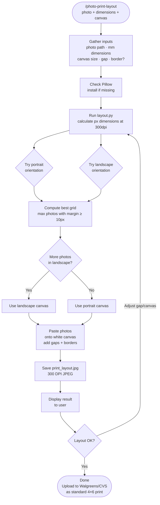

# photo-print-layout

A Claude Code skill that tiles any fixed-size ID or passport photo onto a standard print canvas (4×6, 5×7, etc.) at 300 DPI — ready to upload to Walgreens, CVS, or any photo lab. Given a photo and its dimensions in mm, it auto-calculates the optimal grid layout, margins, and gaps, then outputs a single print-ready JPEG.

## What It Does

- Accepts any ID photo size (Chinese passport, US passport, UK biometric, 1-inch, 2-inch, etc.)
- Auto-selects cols × rows grid that maximizes photos while keeping clean margins
- Tries both portrait and landscape canvas orientations, picks the better fit
- Adds configurable gaps between photos for easy cutting
- Draws optional thin black borders around each photo as cut guides
- Saves at 300 DPI with embedded resolution metadata

## Workflow



## Install

```bash
git clone https://github.com/biomystery/claude-skills.git
mkdir -p ~/.claude/skills
ln -s "$(pwd)/claude-skills/photo-print-layout" ~/.claude/skills/photo-print-layout
```

Restart Claude Code — `/photo-print-layout` will be available.

## Usage

```bash
# Interactive — Claude asks for inputs
/photo-print-layout

# Chinese passport photo (33×48mm) on 4×6
/photo-print-layout photo.jpg 33 48

# US passport photo (51×51mm) on 5×7
/photo-print-layout photo.jpg 51 51 --canvas 5x7

# UK biometric, small gap, no border
/photo-print-layout photo.jpg 35 45 --gap 1 --canvas 4x6
```

## Output

**Sample output** (illustrative values):
```
Saved: print_layout.jpg
Canvas: 4x6" (portrait), 1200x1800px @ 300dpi
Photo:  33x48mm → 390x567px
Grid:   2x3 = 6 photos, gap=2mm
Margins: left/right=204px (17.3mm), top/bottom=37px (3.1mm)
```

## Common ID Photo Sizes

| Type | Width (mm) | Height (mm) |
|------|-----------|------------|
| Chinese passport / visa | 33 | 48 |
| US passport | 51 | 51 |
| UK / EU biometric | 35 | 45 |
| Indian / Korean / Japanese passport | 35 | 45 |
| 1-inch 一寸 (China) | 25 | 35 |
| 2-inch 二寸 (China) | 35 | 49 |

## Supported Inputs / Edge Cases

- **Photo too wide for 3 columns**: script enforces `min_margin_px=10` and automatically drops to fewer columns
- **Square photos (e.g., US passport)**: landscape orientation often fits more — script tries both
- **HEIC source photos**: convert first with `sips -s format jpeg photo.heic --out photo.jpg`
- **Non-300 DPI output**: pass `--dpi 600` for higher resolution labs

## Requirements

- Python 3
- Pillow: `pip3 install Pillow`

## Skill Structure

```
photo-print-layout/
├── SKILL.md        (skill definition — Claude reads this)
├── README.md       (this file)
└── scripts/
    └── layout.py   (Python script for layout calculation and rendering)
```
