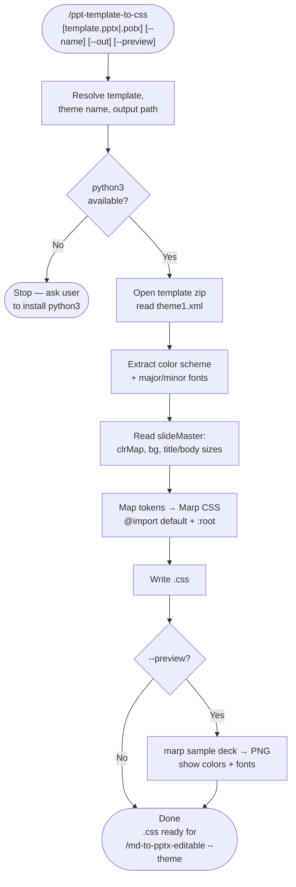

# ppt-template-to-css

A Claude Code skill that turns a PowerPoint template (`.pptx` / `.potx`) into a [Marp](https://marp.app) theme CSS. It reads the template's OOXML theme — color scheme, major/minor fonts, and the slide master's title/body sizes — and writes a Marp theme that `@import`s `default` and applies those tokens. Pair it with [`md-to-pptx-editable`](../md-to-pptx-editable/) to render a markdown deck in an existing brand's look. The extractor is **pure Python stdlib** (no dependencies).

## What It Does

- Parses `ppt/theme/theme1.xml` for the color scheme (`dk1/lt1/accent1-6/hlink`) and major/minor fonts
- Parses `ppt/slideMasters/slideMaster1.xml` for the color map, background, and title/body sizes & colors
- Maps PowerPoint tokens → Marp CSS: background, body text, accent (h2/bold/bullets), six accent variables, link color, heading/body fonts, and clamped title/body sizes
- Writes a readable, hand-tunable `@theme` CSS file
- `--preview` renders a sample deck so you can see the colors and fonts before using it

## What Gets Mapped

| PowerPoint theme element | Marp CSS |
| --- | --- |
| `bg1` (via master `clrMap`) | `section` background |
| `tx1` | body text color |
| `accent1` | `--accent` → h2, bold, bullets, pagination |
| `accent1-6` | `--accent1 … --accent6` variables |
| `hlink` | link color |
| Major / minor fonts | heading / body `font-family` |
| Master title / body lvl1 size | `h1` size / body `font-size` |

## Workflow



## Install

```bash
git clone https://github.com/biomystery/claude-skills.git /tmp/claude-skills
mkdir -p ~/.claude/skills
ln -s /tmp/claude-skills/ppt-template-to-css ~/.claude/skills/ppt-template-to-css
```

Restart Claude Code — `/ppt-template-to-css` will be available.

## Usage

```bash
# Generate a theme from a template (CSS written next to it)
/ppt-template-to-css brand-template.potx

# Name the theme and choose an output path
/ppt-template-to-css deck.pptx --name acme --out themes/acme.css

# Generate and render a preview deck
/ppt-template-to-css template.pptx --preview
```

Then use it with the companion skill:

```bash
/md-to-pptx-editable slides.md --theme acme.css
```

## Output

**Sample report** (illustrative values):

```
OUT=themes/acme.css
theme=acme  bg=#ffffff  text=#1a1a1a  accent=#c8102e  head='Georgia'  body='Arial'  title=58px  body_font=26px
```

A single Marp theme `.css` — `@import 'default'`, a `:root` token block, and element rules for `section`, `h1`/`h2`/`h3`, bullets, bold, links, and pagination.

## Requirements

| Tool | Install | Purpose |
| --- | --- | --- |
| `python3` | system | Theme extraction (stdlib only) |
| `@marp-team/marp-cli` | `npm i -g @marp-team/marp-cli` | `--preview` only |
| Chrome / Chromium | system install | `--preview` only |

## Supported Inputs / Edge Cases

- **`.pptx` and `.potx`** — same OOXML package structure.
- **`sysClr`** (windowText/window) — resolved via `lastClr`, falling back to black/white.
- **Missing master sizes** — falls back to 44pt title / 18pt body.
- **Oversized placeholder sizes** — clamped to legible ranges (title 36–66px, body 22–30px).
- **Not extracted** — background images, gradients, picture fills, effects, per-layout geometry. The CSS approximates color + type; tune from there.
- **Brand fonts** — emitted by name with sans fallbacks; install the font where Marp renders, or edit the `--font-head`/`--font-body` variables.

## Skill Structure

```
ppt-template-to-css/
├── SKILL.md
├── README.md
└── scripts/
    └── template_to_css.py   (parse OOXML theme → Marp CSS)
```
