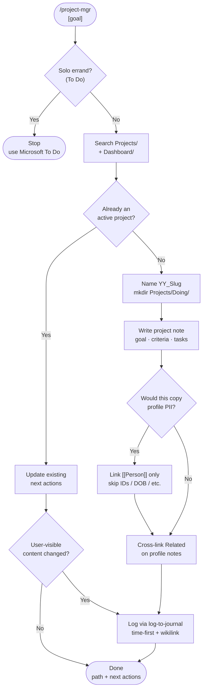

# project-mgr

Builds an active Obsidian project from a one-line goal. Creates `Projects/Doing/<YY>_<Slug>/`, seeds success criteria / workstreams / `#task` next actions, cross-links related notes, and announces the project in today's daily journal — without inventing deadlines or copying private profile fields.

## What It Does

- Classifies agent-worthy goals into `Projects/Doing/` (rejects solo To Do errands)
- Deduplicates against existing Doing/Done projects before creating
- Writes a structured project note: goal, success criteria, workstreams, next actions, open questions
- Tags trackable checkboxes with `#task` only (vault GTD rule)
- Cross-links people via `[[wikilinks]]` instead of duplicating PII
- Logs creation through the log-to-journal workflow

## Workflow



## Install

```bash
git clone https://github.com/biomystery/claude-skills.git
mkdir -p ~/.claude/skills
ln -s "$(pwd)/claude-skills/project-mgr" ~/.claude/skills/project-mgr
```

Also install [log-to-journal](../log-to-journal/) (journal announce step). Restart Claude Code / Cursor — `/project-mgr` becomes available.

## Usage

```
/project-mgr publish Alex's first comic book
/project-mgr plan a backyard compost bin
/project-mgr close out the ExampleCo warranty claim for a dishwasher
```

## Output

- Project folder + note under `Projects/Doing/`
- 2–4 `#task` next actions with done criteria
- Related wikilinks; journal bullet with timestamp

**Sample output** (illustrative / fictional):

```
Projects/Doing/26_Example_Comic/26_Example_Comic.md
  Goal: Publish Alex's first comic book
  Success criteria: story locked · pages done · PDF or print in hand
  Tasks:
    - [ ] Decide format → pick print vs PDF #task
    - [ ] Capture story seed → title + one-sentence premise #task
Journal:
  - 11:53 📁 Example comic project
	- Created [[Projects/Doing/26_Example_Comic/26_Example_Comic|Example Comic]] — goal: publish first comic; next: pick format
```

## Requirements

- Obsidian vault using `Projects/Doing/` + `Journals/YYYY/YYYY-WXX/YYYY-MM-DD.md`
- `#task` opt-in task system (`Dashboard/Tasks.md`)
- Companion skill: `log-to-journal`

## Supported inputs / edge cases

| Situation | Handling |
|---|---|
| Goal is a one-shot errand | Refuse; point to Microsoft To Do |
| Matching active project exists | Update in place; journal only if next actions changed |
| Unknown deadline / owner / format | Open question — do not invent |
| Person has a rich profile note | Confirm exists + wikilink only; do not read/copy body fields |
| Journal file missing | Stop and ask (Calendar plugin usually creates it) |

## Privacy

- Skill docs and samples use **fictional** names and figures only
- Example goals/slugs in this skill must stay fictional and must **not** mirror identifiable real vault project titles
- Runtime: minimize sensitive fields in project notes; keep them on profile notes behind wikilinks
- Never commit vault content, receipts, or real family data into this skills repository

## Skill Structure

```
project-mgr/
├── SKILL.md
└── README.md
```
