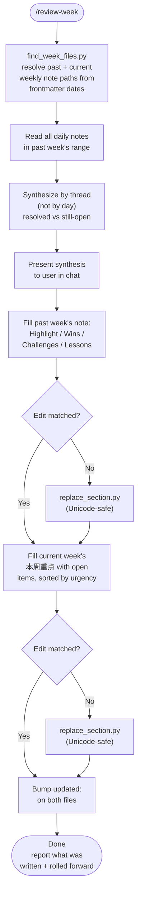

# review-week

Review the past week's Obsidian daily journal entries, synthesize them into last week's weekly-note retrospective (Wins / Challenges / Lessons), and roll only the still-open threads forward into the current week's priorities list. Built for a vault using the `Journals/YYYY/YYYY-WNN.md` (weekly) + `Journals/YYYY/YYYY-WNN/YYYY-MM-DD.md` (daily) layout.

## What It Does

- Resolves the past-week and current-week weekly notes from **frontmatter dates**, not a guessed week number — handles vaults where Sun–Sat weeks are numbered by the ISO week of the Monday inside them
- Reads every daily note in the past week's range
- Groups entries by **thread/project** across days, not by calendar day, and marks each resolved or still-open
- Writes a synthesized retrospective into last week's weekly note: Highlight, checked-off intentions, Wins, Challenges, Lessons
- Populates the current week's priorities section with only the unresolved items, sorted by urgency (🔴 urgent / 🟠 this week / 🟡 follow-up)
- Falls back to a Unicode-safe section-replace script when curly quotes or CJK punctuation in template placeholder text defeat an exact `Edit` match

## Workflow



## Install

```bash
git clone https://github.com/biomystery/claude-skills.git
ln -s "$(pwd)/claude-skills/review-week" ~/.claude/skills/review-week
```

Restart Claude Code — `/review-week` becomes available.

## Usage

```
/review-week
review my past week
close out this week and carry open tasks forward
```

## Output

**Sample** (illustrative, fictional values) — past week's weekly note gains:

```markdown
## 🎉 Wins
- 🏦 Opened a new business checking account for a signup bonus; funding transfer in progress
- 🔧 Fixed a home appliance issue same-day

## 🚧 Challenges
- 📦 A vendor delivery slipped twice due to scheduling conflicts between two crews

## 💡 Lessons
- A firm follow-up call resolved a stuck vendor issue faster than waiting passively
```

...and the current week's note gains:

```markdown
## 📋 本周重点

### 🔴 紧急
- [ ] Confirm the rescheduled delivery actually happens on the new date

### 🟠 本周
- [ ] Confirm the bank transfer landed and the funding minimum was met

### 🟡 跟进
- [ ] File the delayed tax form (auto-extended, no hard deadline yet)
```

## Requirements

- Obsidian vault using `Journals/YYYY/YYYY-WNN.md` + `Journals/YYYY/YYYY-WNN/YYYY-MM-DD.md` layout
- Each weekly note has `journal-start-date` / `journal-end-date` frontmatter
- `python3`

## Supported inputs / edge cases

| Situation | Handling |
|---|---|
| Week numbered by Monday's ISO week but note spans Sun–Sat | `find_week_files.py` reads frontmatter date ranges instead of computing a week number |
| No earlier weekly note exists | Stop and tell the user, or offer current-week-only rollup |
| `Edit` can't match template placeholder text (curly quotes, CJK) | `replace_section.py` does a boundary-based, UTF-8-safe section replace |
| Weekly file rewritten by linter mid-edit | Re-read, then edit |
| A thread already resolved during the week | Goes into Wins/Challenges, not into the current week's open items |

## Skill Structure

```
review-week/
├── SKILL.md
├── README.md
└── scripts/
    ├── find_week_files.py
    └── replace_section.py
```
