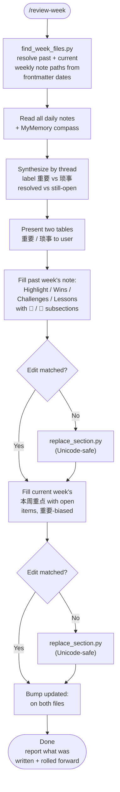

# review-week

Review the past week's Obsidian daily journal entries, synthesize them into last week's weekly-note retrospective (Wins / Challenges / Lessons), **split 重要 vs 琐事**, and roll only the still-open threads forward into the current week's priorities list. Built for a vault using the `Journals/YYYY/YYYY-WNN.md` (weekly) + `Journals/YYYY/YYYY-WNN/YYYY-MM-DD.md` (daily) layout.

## What It Does

- Resolves the past-week and current-week weekly notes from **frontmatter dates**, not a guessed week number — handles vaults where Sun–Sat weeks are numbered by the ISO week of the Monday inside them
- Reads every daily note in the past week's range, plus `AI Memory/MyMemory.md` as the priority compass
- Groups entries by **thread/project** across days, not by calendar day, marks each resolved or still-open, and labels each **🎯 重要** or **📎 琐事**
- Writes a synthesized retrospective into last week's weekly note: Highlight (重要 only), checked-off intentions, Wins/Challenges/下周计划 with 重要·琐事 subsections, Lessons
- Populates the current week's priorities section with unresolved items (重要-biased), sorted by urgency (🔴 urgent / 🟠 this week / 🟡 follow-up)
- Falls back to a Unicode-safe section-replace script when curly quotes or CJK punctuation in template placeholder text defeat an exact `Edit` match

## Workflow



## Install

```bash
git clone https://github.com/biomystery/claude-skills.git
ln -s "$(pwd)/claude-skills/review-week" ~/.claude/skills/review-week
```

Restart Claude Code — `/review-week` becomes available.

## Usage

```
/review-week
review my past week
close out this week and carry open tasks forward
/review-week just do it
```

## Output

**Sample** (illustrative, fictional values) — past week's weekly note gains:

```markdown
## ✨ Highlight
Locked the job search down to one primary track; closed out a stalled interview thread.

## 🎉 Wins

### 🎯 重要
- Narrowed job search to a single primary track; deprioritized side projects
- Bank funding minimum met for a signup bonus

### 📎 琐事
- Vendor issued a $500 store credit after a failed appliance swap

## 🚧 Challenges

### 🎯 重要
- Insurance denied a billing dispute — need to pick the next appeal path

### 📎 琐事
- Warranty ticket ping-pong burned an evening

## 💡 Lessons
- Single-thread commitment beats a menu of evening bets
```

...and the current week's note gains:

```markdown
## 📋 本周重点

### 🔴 紧急
- [ ] Confirm the rescheduled appointment happens on the new date
- [ ] Pick next step on the billing appeal and start it

### 🟠 本周
- [ ] Send out the next batch of job applications
- [ ] Two follow-up calls for an open family claim

### 🟡 跟进
- [ ] Tax form (~auto-extended) — consider CPA
- [ ] Warranty escalation: wait until date X, then self-buy parts
```

## Requirements

- Obsidian vault using `Journals/YYYY/YYYY-WNN.md` + `Journals/YYYY/YYYY-WNN/YYYY-MM-DD.md` layout
- Each weekly note has `journal-start-date` / `journal-end-date` frontmatter
- `python3`
- Priority compass (expected in this vault): `AI Memory/MyMemory.md`

## Supported inputs / edge cases

| Situation | Handling |
|---|---|
| Week numbered by Monday's ISO week but note spans Sun–Sat | `find_week_files.py` reads frontmatter date ranges instead of computing a week number |
| No earlier weekly note exists | Stop and tell the user, or offer current-week-only rollup |
| `Edit` can't match template placeholder text (curly quotes, CJK) | `replace_section.py` does a boundary-based, UTF-8-safe section replace |
| Weekly file rewritten by linter mid-edit | Re-read, then edit |
| A thread already resolved during the week | Goes into Wins/Challenges, not into the current week's open items |
| Household saga with money + lots of chat noise | Decision/outcome → 重要; ping-pong → 琐事 (or omit from Highlight) |
| Open 琐事 with no deadline | Do not roll forward |

## Skill Structure

```
review-week/
├── SKILL.md
├── README.md
└── scripts/
    ├── find_week_files.py
    └── replace_section.py
```
