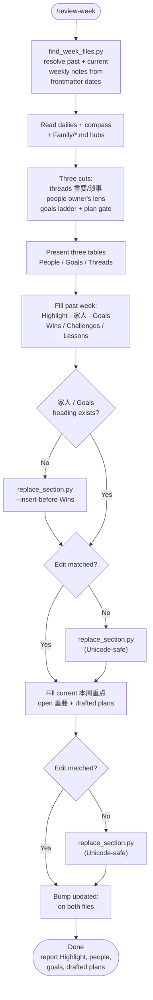

# review-week

Review the past week's Obsidian daily journal entries, synthesize them into last week's weekly-note retrospective (Wins / Challenges / Lessons), **split 重要 vs 琐事**, write a **per-person family section from the vault owner's perspective**, check **primary-goal progress** on a long-term → short-term ladder, **draft a plan for any important goal that lacks one**, and roll only the still-open threads (plus drafted plans) into the current week's priorities. Built for `Journals/YYYY/YYYY-WNN.md` + `Journals/YYYY/YYYY-WNN/YYYY-MM-DD.md`.

## What It Does

- Resolves past-week and current-week notes from **frontmatter dates**, not a guessed week number — handles vaults where Sun–Sat weeks are numbered by the ISO week of the Monday inside them
- Reads every daily note in range, plus the goal compass (Self-Operating Manual, yearly/quarterly notes, MyMemory) and top-level `Family/*.md` hub notes
- Groups entries by **thread/project** across days, labels each **🎯 重要** or **📎 琐事**, and marks resolved vs still-open
- Writes **👥 家人**: one subsection per family hub person, in the owner's voice (how I showed up for them — quiet weeks still get a stub)
- Writes **🎯 Goals**: every important goal with long-term parent, short-term trace, this week's progress, and a Plan cell — drafts a next action when none exists
- Writes Highlight / checked-off intentions / Wins / Challenges / 下周计划 / Lessons (重要·琐事 split)
- Populates the current week's priorities with unresolved 重要 items **and drafted goal plans**, sorted by urgency (🔴 / 🟠 / 🟡)
- Inserts missing People/Goals headings on older weekly notes; falls back to a Unicode-safe section-replace script when curly quotes or CJK punctuation defeat `Edit`

## Workflow



## Install

```bash
git clone https://github.com/biomystery/claude-skills.git
ln -s "$(pwd)/claude-skills/review-week" ~/.claude/skills/review-week
```

Restart Claude Code — `/review-week` becomes available.

## Usage

```
/review-week
review my past week
close out this week and carry open tasks forward
/review-week just do it
```

## Output

**Sample** (illustrative, fictional values) — past week's weekly note gains:

```markdown
## ✨ Highlight
Locked the job search down to one primary track; closed out a stalled interview thread.

## 👥 家人

### [[Jordan]]
- **This week:** sent 2 Director apps; profile still unrevised
- **Primary:** next-role leap
- **Progress:** stalled — below the 3–5/week cadence
- **Plan:** 3 targeted apps + profile Step 0 this week [[job-search]]

### [[Alex]]
- **This week:** read the grade-9 counseling deck with them
- **Primary:** freshman landing — study skills
- **Progress:** moved (info gathered, no practice loop yet)
- **Plan:** ⚠️ drafted: Sun 20-min planning block

## 🎯 Goals

Guided by: [[Self-Operating Manual]] 3–5yr → [[YYYY-Q3]] PRIMARY → this week's traces.

| Goal | Long-term parent | Short-term trace | This week | Plan |
|---|---|---|---|---|
| Next role | career leap | 3–5 apps/week | stalled (2 apps) | 3 targeted apps this week [[job-search]] |
| Freshman study skills | family rhythm | counseling deck → practice loop | moved (deck read) | ⚠️ drafted: Sun 20-min planning block |

## 🎉 Wins

### 🎯 重要
- Narrowed job search to a single primary track
- Bank funding minimum met for a signup bonus

### 📎 琐事
- Vendor issued a $500 store credit after a failed appliance swap
```

...and the current week's note gains:

```markdown
## 📋 本周重点

### 🔴 紧急
- [ ] Confirm the rescheduled appointment happens on the new date

### 🟠 本周
- [ ] Send 3 targeted Director apps [[job-search]]
- [ ] Sun 20-min planning block with [[Alex]]

### 🟡 跟进
- [ ] Tax form (~auto-extended) — consider CPA
```

## Requirements

- Obsidian vault using `Journals/YYYY/YYYY-WNN.md` + `Journals/YYYY/YYYY-WNN/YYYY-MM-DD.md`
- Each weekly note has `journal-start-date` / `journal-end-date` frontmatter
- `python3`
- Optional compass: `Family/<Name>/AI Memory/MyMemory.md`, Self-Operating Manual, quarterly note
- Optional family hubs: top-level `Family/*.md`

## Supported inputs / edge cases

| Situation | Handling |
|---|---|
| Week numbered by Monday's ISO week but note spans Sun–Sat | `find_week_files.py` reads frontmatter date ranges instead of computing a week number |
| No earlier weekly note exists | Stop and tell the user, or offer current-week-only rollup |
| `Family/` missing | Skip 👥 家人; still write Goals + threads |
| Older weekly note has no 家人 / Goals heading | `replace_section.py --insert-before "## 🎉 Wins"` |
| `Edit` can't match template placeholder text (curly quotes, CJK) | `replace_section.py` does a boundary-based, UTF-8-safe section replace |
| Weekly file rewritten by linter mid-edit | Re-read, then edit |
| A thread already resolved during the week | Goes into Wins/Challenges, not into the current week's open items |
| Important goal with no next action | Draft one this-week action; flag `⚠️ drafted`; put it on current 本周重点. Do not auto-create a project folder |
| Household saga with money + lots of chat noise | Decision/outcome → 重要; ping-pong → 琐事 (or omit from Highlight) |
| Open 琐事 with no deadline | Do not roll forward |
| Person hub contains IDs / DOB / medical details | Link `[[Name]]` only; never copy those fields into the weekly note |

## Skill Structure

```
review-week/
├── SKILL.md
├── README.md
├── reference.md
└── scripts/
    ├── find_week_files.py
    └── replace_section.py
```
