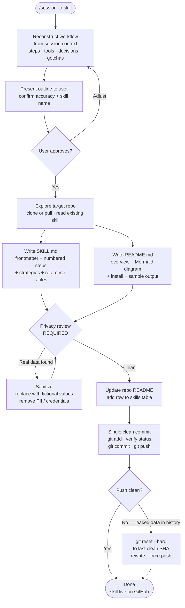

# session-to-skill

A meta Claude Code skill that abstracts a just-completed task into a reusable, publishable skill — without re-explaining anything. Invoke it at the end of a session; Claude reconstructs the workflow from context, drafts `SKILL.md` and `README.md`, runs a privacy review, and pushes a single clean commit.

## What It Does

- Reconstructs the workflow you just completed from the current session's context
- Asks only for confirmation and a skill name — no re-description needed
- Writes `SKILL.md` (the instruction file Claude executes) and `README.md` (user docs)
- Generates a Mermaid flowchart of the workflow automatically
- Enforces a privacy review before any `git` operation
- Publishes as one clean commit; includes a `reset + force push` recovery path if history needs rewriting

## Workflow



## Install

```bash
git clone https://github.com/biomystery/claude-skills.git
mkdir -p ~/.claude/skills
ln -s "$(pwd)/claude-skills/session-to-skill" ~/.claude/skills/session-to-skill
```

Restart Claude Code — `/session-to-skill` will be available.

## Usage

```bash
# At the end of any Claude Code session worth capturing:
/session-to-skill

# Targeting a specific repo:
/session-to-skill --repo https://github.com/you/your-skills
```

**Important**: invoke this *before closing the session*. Claude needs the current conversation context to reconstruct the workflow — it cannot do so from a cold start.

## Output

| File | Purpose |
|------|---------|
| `<skill-name>/SKILL.md` | Instruction file Claude reads and executes |
| `<skill-name>/README.md` | User docs with Mermaid workflow diagram |

## Key Practices Encoded in This Skill

### Reconstruct, don't re-ask
The whole point of invoking this right after a task is that Claude already knows what happened. Step 1 derives the workflow from session context — the user only confirms and names it.

### Privacy gate before every commit
Any sample output or illustrative table must use **fictional data** — never figures from real documents processed during the session. A "fix" commit is not enough if real data was already pushed; the recovery is `git reset --hard` + `git push --force`.

### Mermaid diagram in every README
The `## Workflow` section with a `flowchart TD` diagram makes the skill self-documenting at a glance on GitHub. Aim for 8–15 nodes with clear decision diamonds.

### No scripts unless truly necessary
Add `scripts/` only for non-trivial compute (image processing, ML). Everything else — PDF parsing, text extraction, file writing, data analysis — is handled by CLI tools + Claude's built-in tools.

### One clean commit
Resolve everything locally. Never push an iterative "add / fix typo / fix privacy" series of commits.

## Requirements

- **Git** with push access to the target skills repository
- Must be invoked **in the same session** as the task being abstracted

## Skill Structure

```
session-to-skill/
├── SKILL.md    (skill definition — Claude reads this)
└── README.md   (this file)
```
