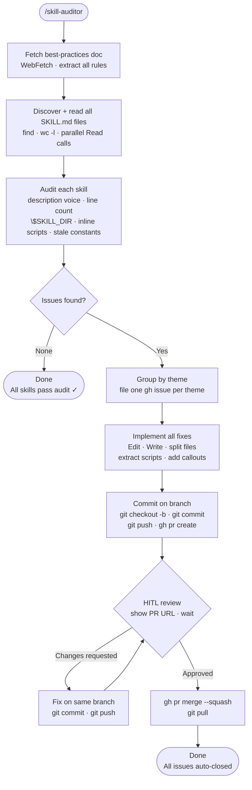

# skill-auditor

A Claude Code skill that audits an entire skills repository against the [official best-practices doc](https://platform.claude.com/docs/en/agents-and-tools/agent-skills/best-practices) in one pass — filing themed GitHub issues and implementing every fix in a single clean commit.

## What It Does

- Fetches the live best-practices doc and reads all SKILL.md files in parallel
- Checks 7 violation categories: description voice, "Use when" trigger, line count, `$SKILL_DIR` definition, inline script size, stale year constants, and path style
- Groups findings by theme across skills (not one issue per skill) for a clean issue list
- Files one `gh issue` per theme with affected files and fix recipes
- Implements all auto-fixable changes: frontmatter edits, file splits, `$SKILL_DIR` injection, script extraction, constant callouts
- Pushes one commit that auto-closes all filed issues

## Workflow



## Install

```bash
git clone https://github.com/biomystery/claude-skills.git
mkdir -p ~/.claude/skills
ln -s "$(pwd)/claude-skills/skill-auditor" ~/.claude/skills/skill-auditor
```

Restart Claude Code — `/skill-auditor` will be available.

## Usage

```bash
# Audit the default skills directory ($SKILLS_REPO_DIR or ~/projects/claude-skills):
/skill-auditor

# Audit a specific repo (clones if not already present):
/skill-auditor --repo https://github.com/you/your-skills
```

## Output

**Sample output** (illustrative values):

```
Issues filed:
  #2 — All skills: description uses imperative voice (8 skills)
  #3 — data-dictionary: SKILL.md is 538 lines, over limit
  #4 — photo-print-layout, photo-year-collage: $SKILL_DIR undefined
  #5 — passport-photo-check, md-to-docx: large inline scripts
  #6 — Tax skills: hardcoded year constants will go stale

Fixes implemented:
  Modified: 9 SKILL.md files (descriptions)
  Created:  data-dictionary/UPDATE_MODE.md
  Created:  passport-photo-check/scripts/measure_photos.py
  Created:  md-to-docx/scripts/render_mermaid.py
  Created:  md-to-docx/scripts/style_tables.py

Commit: abc1234 — "audit skills against best-practices docs (closes #2 #3 #4 #5 #6)"
```

## Audit Checklist

| Category | What's checked |
|---|---|
| Description voice | Must start with third-person verb (Converts, Builds…) |
| Discovery trigger | Must include "Use when…" phrase |
| File size | SKILL.md body ≤ 500 lines |
| `$SKILL_DIR` | Defined before first use |
| Inline scripts | > 15 lines → extract to `scripts/` with argparse |
| Year constants | Year-specific figures → ⚠️ callout added |
| Path style | No Windows backslashes |

## Requirements

- **`gh` CLI** authenticated (`gh auth status`)
- **Git** with push access to the skills repository
- Skills repo cloned locally, or use `--repo <url>`

## Supported Edge Cases

- **Nested code fences in SKILL.md templates**: when splitting a section that contains markdown code blocks, use blockquote-indented fences in the stub to avoid breaking the outer fence
- **`$SKILL_DIR` in example commands vs. live commands**: only add resolution line when the variable is used in an executable step, not in illustrative examples
- **Scripts with domain-specific logic**: flagged for manual review rather than auto-extracted if the extraction would require understanding the domain (e.g., tax line numbers)
- **Zero issues found**: skill exits cleanly with a pass summary, no commit made

## Skill Structure

```
skill-auditor/
├── SKILL.md    (skill definition — Claude reads this)
└── README.md   (this file)
```
