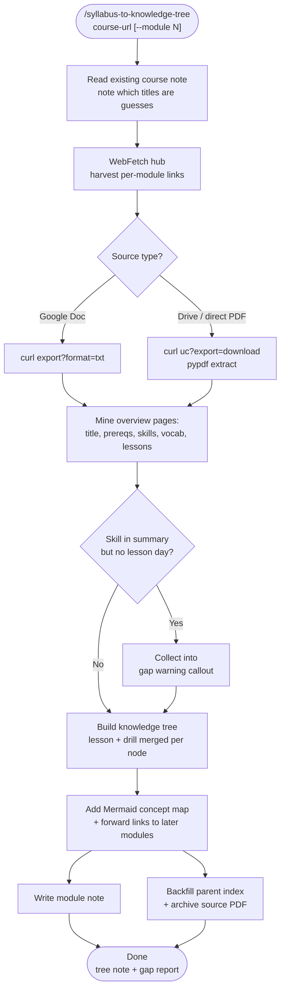

# syllabus-to-knowledge-tree

Turns a course's official materials — module PDFs, Google Docs, a syllabus page — into a single note a student can actually revise from. Course sites publish teacher-facing artifacts: standards codes, lesson inventories, forty-page problem packets. This skill extracts the durable structure, reorganizes it as a **knowledge tree** (concepts nested by dependency rather than lessons listed by date), and reports which topics the course promises but never schedules a day for.

## What It Does

- Harvests every per-module link from a course hub page (student editions, homework, practice docs)
- Pulls the real source text — works around WebFetch's blind spots with Google Docs and PDFs
- Reads only the **overview pages** of a module packet (~4 of 40) — the rest is worked problems
- Confirms the module's **actual title**, replacing whatever the index note guessed
- Merges each lesson with its practice drills into **one tree node** — no cross-referencing two sections to study one idea
- Drops teacher-facing noise (standards codes, pacing, practice-standard lists)
- Emits a Mermaid **concept map** showing why the topics belong in the same unit
- **Diffs the skills summary against the lesson map** → flags assigned-but-untaught topics
- Keeps prerequisites and vocabulary as quick checks: a checkbox list and a collapsible callout
- Links concepts forward to later modules, so the vault becomes a graph
- Archives the source PDF and backfills the parent index with a resource table

## Workflow



## Install

```bash
git clone https://github.com/biomystery/claude-skills.git
mkdir -p ~/.claude/skills
cp -r claude-skills/syllabus-to-knowledge-tree ~/.claude/skills/
pip3 install --user pypdf
```

## Usage

```bash
/syllabus-to-knowledge-tree <course-hub-url> --module 1     # one module
/syllabus-to-knowledge-tree <course-hub-url> --modules 2-8  # the rest
/syllabus-to-knowledge-tree ~/Downloads/unit3_packet.pdf    # local packet, no hub
```

The helper script is usable on its own:

```bash
python3 scripts/fetch_course_doc.py "<google-doc-url>"
python3 scripts/fetch_course_doc.py "<drive-url>" --outline | head -60
python3 scripts/fetch_course_doc.py "<drive-url>" --pages 2-5 --save ~/Documents/archive/unit3.pdf
```

## Output

A module note structured as:

```
> [!abstract] The one idea      <- the module's insight in one sentence
## Map                          <- Mermaid dependency spine
## Knowledge tree               <- 3 levels: branch > cluster > idea, drills merged in
> [!warning] Not taught         <- assigned-but-unscheduled topics
## Quick check — prerequisites  <- checkbox list
## Quick check — vocabulary     <- collapsible, clustered
## Where it goes next           <- forward links to later modules
## Resources                    <- source links + archive path
```

**Sample tree node** (illustrative):

```markdown
- **2 · Wave behavior**
	- **2.1 Superposition** `3.4` `3.5`
		- Two waves in the same place add displacement-by-displacement
		- Constructive vs destructive is just the sign of that sum
		- *Drill:* interference patterns · path difference · standing-wave nodes
```

**Sample gap report** (illustrative):

> ⚠️ **Not taught, still expected** — Logarithmic scales and unit conversion appear in the unit summary and homework, but get no class day. Review from Unit 2 before the term starts.

## Requirements

- `python3` with `pypdf` — `pip3 install --user pypdf`
- `curl`
- WebFetch access to the course site
- An Obsidian vault, or any folder of Markdown notes

## Supported Inputs / Edge Cases

| Input | Handling |
|---|---|
| Google Doc `/preview` URL | WebFetch returns an empty shell → falls back to `export?format=txt` |
| Google Drive file link | Rewritten to `uc?export=download`; `%PDF-` magic bytes validated |
| Direct PDF URL or local path | Read straight through `pypdf` |
| Sign-in-required file | Detected (non-PDF bytes) and reported rather than silently parsed |
| macOS without `pdftotext` | Never used — `pypdf` throughout |
| Hub lists module numbers only | Expected; real titles come from the packet cover |
| Math glyphs missing from extracted text | Subset-font artifact — formulas retyped as LaTeX from surrounding prose |
| Vault uses Sunday-start weeks | Journal path verified against sibling folders, not `date +%V` |

## Skill Structure

```
syllabus-to-knowledge-tree/
├── SKILL.md
├── README.md
└── scripts/
    └── fetch_course_doc.py
```
