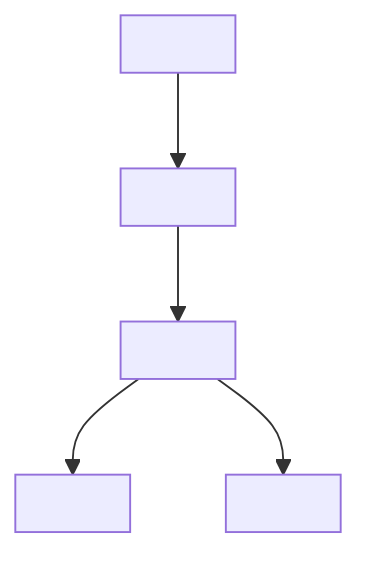

# Syllabus to Knowledge Tree

Converts a course's official materials into one note a student can actually revise from. Course sites publish teacher-facing artifacts — standards codes, lesson inventories, worked-problem packets — which are exhaustive but unreadable. This skill extracts the durable structure, reorganizes it as a **knowledge tree** (concepts nested by dependency, not lessons listed by date), and surfaces the gap between what the course *claims* to teach and what it *schedules* a day for.

> Related but different: `/hub-from-outline` scaffolds an **empty structure to fill in over time** (hub, module stubs, dated period notes). This skill writes a **finished revision note** per module. Do not substitute one for the other.
>
> **They compose.** Run `/hub-from-outline` once at the start of a course to scaffold `Modules/M01 …` stubs, then run this skill per module to fill a stub with the real knowledge tree. When the destination folder already has a hub and module stubs, write into the matching stub instead of creating a parallel note.

## When to Use

- A course has an official site with linked module PDFs, Google Docs, or a syllabus
- You want a revision note per module/unit, not a copy of the syllabus
- You want to know which topics get no class time before the term starts
- Works for any subject; examples below are from a high-school math course

## Core Rules (non-negotiable)

| Rule | Why |
|---|---|
| **Tree, not table** — nest concepts by dependency | A table of lessons teaches sequence; a tree teaches structure. Structure is what survives to the exam |
| **Merge lesson + practice into one node** | Splitting them forces the student to cross-reference two sections to study one idea |
| **Cut teacher-facing content** — standards codes, pacing, SMP lists | Students never need `A.REI.4`. It is pure noise in a revision note |
| **One line per idea, plain English** | "Both x-intercepts sit the same distance from the line of symmetry" beats restating a standard |
| **Never invent a module title** | Titles inferred from topic lists are guesses; the student-edition PDF cover has the real one. Mark guesses in *italics* until confirmed |
| **Gap detection is a deliverable, not a bonus** | The summary-vs-lessons diff is the single most actionable output — surface it as a callout |
| **Prereqs and vocabulary are quick checks** | Keep them, but as a checkbox list and a collapsible callout — not prose to reread |
| Leave study checkboxes **untagged** | A bare `- [ ]` is not a tracked task; tagging them floods the task dashboard |

## Instructions

### Step 0: Prerequisites

`pdftotext` is **not** installed on stock macOS — do not plan around it. The bundled
script uses `pypdf` and installs it on demand, including on PEP 668 environments
(Homebrew and most distro pythons) where a plain `pip install --user` is refused.

`SKILL_DIR` must be assigned in the **same Bash call** that uses it — shell state does
not persist between calls:

```bash
SKILL_DIR="$(dirname "$(realpath ~/.claude/skills/syllabus-to-knowledge-tree/SKILL.md)")"
python3 "$SKILL_DIR/scripts/fetch_course_doc.py" --help
```

### Step 1: Read What the Vault Already Knows

Find the existing course-level note before fetching anything.

```bash
ls "<course-folder>"        # e.g. Family/<Student>/Academy/<Subject> Knowledge Points/
```

Read it. Note which facts are marked as inferred or guessed — those are what the authoritative source will confirm or correct. Do not duplicate content that already lives in the parent note.

### Step 2: Harvest the Course Site Index

("Hub" in this skill's sibling `/hub-from-outline` means a *vault note*. Here the page
being harvested is the **course site index** — the public page listing per-module
links. Keep the two straight when both skills are in play.)

WebFetch the course site and ask for **every link with its module number**, not a summary:

> "List every link on this page under each per-module section, with the module number and full URL. Also give any module titles shown."

Course site indexes typically expose three link families per module: **student edition PDF**, **homework PDF (+ answer key)**, and a **videos/practice Doc**. Capture all three — they populate the resource table later.

If the index shows only module *numbers* with no titles, that is expected. Titles come from Step 3.

### Step 3: Pull the Authoritative Source

WebFetch **cannot** read Google Docs (`/preview` returns an empty shell) and cannot read PDFs. Use the script:

```bash
SKILL_DIR="$(dirname "$(realpath ~/.claude/skills/syllabus-to-knowledge-tree/SKILL.md)")"

# Google Doc (course overview / practice list) -> plain text
python3 "$SKILL_DIR/scripts/fetch_course_doc.py" "<google-doc-url>"

# Module PDF: survey page structure first
python3 "$SKILL_DIR/scripts/fetch_course_doc.py" "<drive-url>" --outline | head -60

# Then pull the overview pages in full, and archive the PDF
python3 "$SKILL_DIR/scripts/fetch_course_doc.py" "<drive-url>" --pages 2-5 \
  --save ~/Documents/archive/<course>_Module<N>_Student_Edition.pdf
```

**Read the overview pages, not the whole packet.** A 40-page module PDF is ~4 pages of structure (cover, prerequisites, skills summary, vocabulary, lesson map) followed by ~36 pages of worked problems. The first four carry everything the note needs; the rest is what the student does in class.

Pull two sources per module when both exist:
- **Module PDF** → title, prerequisites, skills summary, vocabulary, lesson-by-lesson map
- **Videos/practice Doc** → the drill topics per section, which merge into the tree nodes

### Step 4: Diff the Summary Against the Lesson Map

This is the highest-value step. The module's "summary of skills" and its numbered lesson list are written by different people and rarely agree.

1. List every skill claimed in the summary.
2. List every topic that has a numbered lesson day.
3. **Anything in (1) but not in (2)** is assigned but never taught — it lives in homework only.

Report these as a `> [!warning]` callout naming the specific topics and where to review them from. In the source session this surfaced rational exponents and exponential growth/decay: promised in the summary, given zero class days.

### Step 5: Write the Knowledge Tree Note

Create `<course-folder>/<Course>/Module <N> — <Real Title>.md`. Use this shape:

````markdown
---
tags: [school, knowledge-points]
course: <Course>
module: <N>
---

# <Course> Module <N> — <Title>

Course → [[<parent note>]] · Index → [[<subject index>]]

> [!abstract] The one idea
> <A single sentence naming the module's actual insight — not a topic list.>

## Map


## Knowledge tree

- **1 · <Branch>**
	- **1.1 <Concept cluster>** `<lesson tags>`
		- <one-line idea, LaTeX where it helps: $x=\frac{-b\pm\sqrt{b^2-4ac}}{2a}$>
		- <the "why", not just the "what">
		- *Drill:* <practice topics for these lessons, comma-separated>

## Quick check — prerequisites
- [ ] <skill assumed on day 1>

## Quick check — vocabulary
> [!question]- Can <student> define each in one sentence?
> **<Cluster>** — term · term · term

## Where it goes next
- <concept> → **Module <M>**

## Resources
| What | Link |

%% Classroom task names, for matching the paper packet: ... %%
````

Shape rules:
- **3 levels max.** Branch → cluster → idea. Deeper is a sign the branch should split.
- **Lesson tags in backticks on the cluster** (`` `1.6H` ``), so the student can find the packet page without a separate table.
- **`*Drill:*` as the last child** of each cluster — practice merged in, never a separate section.
- **Mermaid map is the dependency spine**, 8–14 nodes. It answers "why are complex numbers in a quadratics unit?"
- **"Where it goes next"** links concepts forward to later modules — this is what makes the vault a graph rather than a pile.
- Put classroom/activity names in a `%%comment%%` — needed to match the paper packet, noise when reading.

### Step 6: Backfill the Parent Note

- Replace the guessed module title with the confirmed one and link the new note
- Add a **per-module resource table** (student edition / homework / videos) for *all* modules while you have the links — one WebFetch already paid for them
- Note the archive location of any saved PDFs
- Bump the frontmatter `updated:` field

### Step 7: Log and Report

If the vault has a journal convention, log the work (see `/log-to-journal`). Report to the user: note created, confirmed title, the gap found, and offer to run the remaining modules.

## Gotchas

| Symptom | Cause | Fix |
|---|---|---|
| WebFetch on a Google Doc returns only the page title | `/preview` is a JS shell | `curl ".../export?format=txt"` — what the script does |
| Drive link downloads an HTML page, not a PDF | Wrong URL form | `https://drive.google.com/uc?export=download&id=<ID>`; script validates the `%PDF-` magic bytes |
| `pdftotext: command not found` | Not on stock macOS | Use `pypdf` |
| Relative paths break mid-session | **Bash cwd persists between calls** — one `cd` into a subfolder poisons every later relative path | `cd "<vault-root>" &&` at the front of each command |
| Journal write lands in the wrong week folder | Vaults often use **Sunday-start** weeks; `date +%V` is ISO (Monday-start) | Verify against sibling folders — check which dates share a week directory — before trusting `%V` |
| Extracted PDF text drops variable names (`x`, `a`, `b`) | Math glyphs are embedded as subset fonts | Read around them; take formulas from the prose or retype them as LaTeX |

## Example Invocations

```
/syllabus-to-knowledge-tree https://<course-site>/<course-page>  --module 1
```
→ Fetches the hub, pulls Module 1's PDF + practice doc, writes the tree note, backfills the index.

```
/syllabus-to-knowledge-tree <course-site-url> --modules 2-8
```
→ Same shape for every remaining module.

```
/syllabus-to-knowledge-tree ~/Downloads/unit3_packet.pdf
```
→ Skips the hub; builds the tree straight from a local packet.

## Output

- `<course-folder>/<Course>/Module <N> — <Title>.md` — the knowledge-tree note
- Parent course note updated: confirmed title, link, per-module resource table
- Source PDF archived to the user's document store
- A gap callout naming assigned-but-untaught topics

## Requirements

- `python3` with `pypdf` (the bundled script installs it on demand)
- `curl`
- WebFetch access to the course site
- An Obsidian vault (or any Markdown notes folder)

## Skill Structure

```
syllabus-to-knowledge-tree/
├── SKILL.md
├── README.md
└── scripts/
    └── fetch_course_doc.py
```
