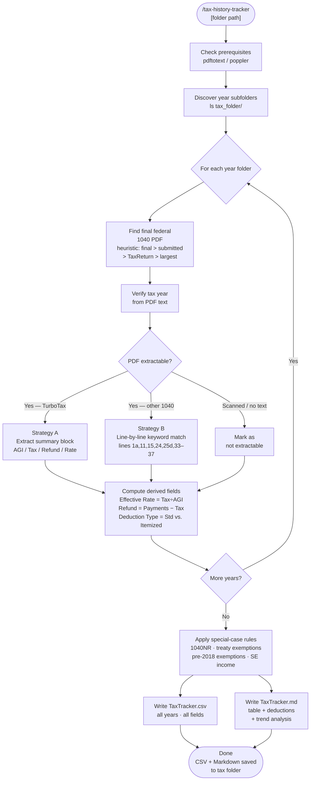

# tax-history-tracker

A Claude Code skill that automatically extracts key financial metrics from years of U.S. federal tax return PDFs (Form 1040) and produces a consolidated, year-over-year tracker — no manual data entry required.

## What It Does

- Scans a tax folder organized by year (e.g., `2020/`, `2021/`, `2022/`)
- Identifies the final federal Form 1040 PDF for each year
- Extracts income, AGI, deductions, taxable income, tax, withholding, and refund/owe
- Handles TurboTax, free fillable forms, and professionally prepared returns
- Flags special cases: non-resident returns, treaty exemptions, itemized vs. standard deduction
- Outputs a **CSV** (for spreadsheets) and a **Markdown summary** with trend analysis

## Workflow



## Install

```bash
# Clone the repo
git clone https://github.com/biomystery/claude-skills.git

# Symlink into your Claude skills directory
mkdir -p ~/.claude/skills
ln -s "$(pwd)/claude-skills/tax-history-tracker" ~/.claude/skills/tax-history-tracker
```

Restart Claude Code — `/tax-history-tracker` will be available as a slash command.

## Usage

```bash
# Scan current directory
/tax-history-tracker

# Specify a folder
/tax-history-tracker ~/Documents/Taxes

# Limit to specific years
/tax-history-tracker ~/Documents/Taxes --years 2019-2024
```

## Output

Two files are saved inside your tax folder:

| File | Format | Use |
|------|--------|-----|
| `TaxTracker.csv` | CSV | Import into Excel, Numbers, or Google Sheets |
| `TaxTracker.md` | Markdown | Human-readable table + trend analysis + per-year notes |

**Sample output columns** (illustrative values):

| Tax Year | Filing Status | W-2 Wages | Federal AGI | Deduction | Taxable Income | Federal Tax | Effective Rate | Withholding | Refund/Owe |
|----------|--------------|----------:|------------:|----------:|---------------:|------------:|---------------:|------------:|-----------:|
| 2021     | MFJ          | $120,000  | $120,500    | $25,100   | $95,400        | $14,200     | 11.8%          | $18,000     | +$3,800    |
| 2022     | MFJ          | $135,000  | $134,800    | $25,900   | $108,900       | $16,500     | 12.2%          | $19,000     | +$2,500    |

## Requirements

- **`pdftotext`** (poppler): `brew install poppler` (macOS) or `apt-get install poppler-utils` (Linux)
- Tax PDFs must be **text-based** (not purely scanned images) — virtually all software-prepared returns qualify
- Tax folder must contain **year-named subfolders** (`2018/`, `2019/`, etc.)

## Supported Return Types

| Return Type | Support | Notes |
|-------------|---------|-------|
| TurboTax PDF | Full | Reads built-in summary block |
| IRS Free File Fillable Forms | Full | Line-by-line extraction |
| Professionally prepared (e.g., H&R Block) | Full | Line-by-line extraction |
| Non-resident 1040NR | Partial | Flagged; limited field mapping |
| Scanned / image-only PDF | None | Marked as not extractable |

## Skill Structure

```
tax-history-tracker/
├── SKILL.md    (skill definition — Claude reads this)
└── README.md   (this file)
```
