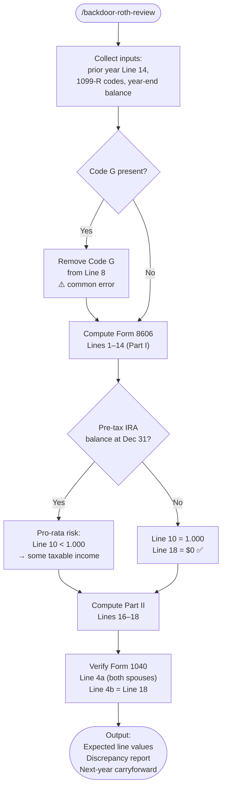

# backdoor-roth-review

A Claude Code skill that verifies a backdoor Roth IRA conversion for U.S. taxpayers. Given broker transaction records and the prior year's Form 8606 Line 14, it computes expected values for every Form 8606 line, catches the most common preparer errors, and confirms that Form 1040 Lines 4a/4b are consistent — with $0 as the target taxable amount.

## What It Does

- Classifies 1099-R codes (Code G = 401k rollover, NOT a Roth conversion; Code 2 = Roth conversion)
- Computes all Form 8606 Part I and Part II line values from scratch
- Checks pro-rata rule exposure (pre-tax IRA balances at year-end)
- Verifies both spouses' 1099-Rs are included in Form 1040 Line 4a
- Flags Form 8606 Line 2 (prior-year basis carryover) — most commonly omitted line
- Outputs expected vs. draft comparison with priority-ranked discrepancies

## Workflow



## Install

```bash
git clone https://github.com/biomystery/claude-skills /tmp/claude-skills
ln -s /tmp/claude-skills/tax/backdoor-roth-review ~/.claude/skills/backdoor-roth-review
```

## Usage

```
/backdoor-roth-review
```

Claude will ask for:
1. Prior year Form 8606 Line 14 (per filer)
2. Broker transaction log (or attach Fidelity/Schwab export)
3. Traditional IRA balance on December 31

Attach a draft tax return PDF to get a side-by-side comparison.

## Output

**Sample output** (fictional values):

```
Form 8606 — Primary Filer
─────────────────────────────────────────────
Part I
  Line 1  (new contributions)      :  $7,000
  Line 2  (carryover basis)        :  $7,000  ✅
  Line 3                           : $14,000
  Line 5                           : $14,000
  Line 6  (IRA year-end balance)   :     $3
  Line 8  (Roth conversion)        :  $7,000
  Line 9                           :  $7,003
  Line 10 (ratio)                  :  1.000
  Line 11 (nontaxable conversion)  :  $7,000
  Line 14 (carryforward)           :     $7,000

Part II
  Line 16                          :  $7,000
  Line 17                          :  $7,000
  Line 18 (TAXABLE)                :     $0  ✅

Form 1040
  Line 4a (gross IRA distributions): $22,000
  Line 4b (taxable IRA)            :     $0  ✅
─────────────────────────────────────────────

⚠️  Draft discrepancy found:
  Line 2 = blank in draft (should be $7,000 — prior year carryover)
  → Fix: enter $7,000 from last year's Form 8606 Line 14
```

## Requirements

- Claude Code (any recent version)
- Prior year's Form 8606 (or knowledge of Line 14 value)
- Broker 1099-R for the tax year
- Broker year-end statement showing December 31 IRA balance

## Key Gotchas

| Situation | What Goes Wrong | How This Skill Catches It |
|---|---|---|
| Code G rollover mixed with Code 2 | Line 8 overstated → phantom taxable income | Checks 1099-R code classification |
| Line 2 left blank | Line 18 > $0, overpays tax | Flags blank Line 2 vs prior year |
| IRA balance = $0 when actually $2–$5 | Minor pro-rata error | Requires actual Dec-31 balance |
| Spouse's 1099-R missing from Line 4a | CP2000 IRS mismatch notice | Verifies both filers' amounts |
| Spring contribution attributed to wrong year | Wrong year's basis | Checks "PRIOR YEAR" label on broker statement |

## Skill Structure

```
tax/backdoor-roth-review/
├── SKILL.md
└── README.md
```
