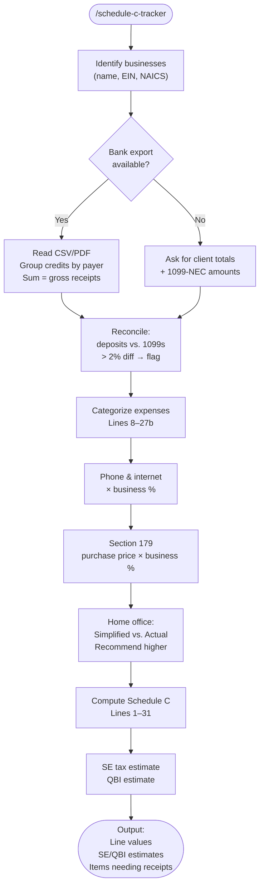

# schedule-c-tracker

A Claude Code skill that builds a complete U.S. Schedule C from raw inputs: bank transaction exports, receipts, and home details. Reconciles gross income against known deposits, maps each expense to the correct Schedule C line, calculates home office and Section 179 equipment deductions, and outputs ready-to-file line values with self-employment tax and QBI deduction estimates.

## What It Does

- Reconciles gross receipts against bank deposits or client-by-client totals
- Maps every expense to the correct Schedule C line (8–30)
- Computes phone and internet deduction using business-use percentage
- Evaluates Section 179 immediate expensing vs. depreciation for equipment
- Compares simplified vs. actual-expense home office methods and recommends the higher deduction
- Computes SE tax (15.3% on 92.35% of net profit) and the 50% SE deduction
- Estimates QBI deduction (20% of net QBI, multi-business aware)
- Flags items that still need receipts or documentation

## Workflow



## Install

```bash
git clone https://github.com/biomystery/claude-skills /tmp/claude-skills
ln -s /tmp/claude-skills/tax/schedule-c-tracker ~/.claude/skills/schedule-c-tracker
```

## Usage

```
/schedule-c-tracker
```

Claude asks for business details, income sources, and expense categories interactively.

```
/schedule-c-tracker
(attach: bank_transactions.csv, receipts_folder/)
```

Claude reads transactions and receipt PDFs, matches them to expense categories automatically.

## Output

**Sample output** (fictional values):

```
Schedule C — Maple Consulting LLC
─────────────────────────────────────────────
Income
  Gross receipts (Line 1)          : $85,000
  Reconciled vs. bank deposits     : ✅ match

Expenses
  [Line 8]  Advertising            :    $600
  [Line 17] Professional fees      :    $800
  [Line 23] Taxes & licenses       :    $890
    CA LLC franchise tax           :   $800
    Business license               :    $90
  [Line 27b] Other expenses
    Internet (50% of $80/mo)       :    $480
    Cell phone (60% of $60/mo)     :    $432
    Equipment — Section 179
      Laptop (100% business)       :  $1,200
      External drive (100%)        :    $140
  [Line 30] Home office (120 sqft) :    $600
  Total expenses                   :  $5,142

Net profit (Line 31)               : $79,858

Self-Employment Tax Estimate       :  $11,322
SE Deduction (Schedule 1)          :   $5,661
QBI Contribution                   : $74,197
Estimated QBI Deduction (20%)      : $14,839
─────────────────────────────────────────────

⚠️  Items needing documentation:
  - Home office: confirm space is used exclusively for business
  - Business meals: provide date, attendees, and business purpose for each receipt
```

## Requirements

- Claude Code (any recent version)
- Income: bank export CSV/PDF, or list of clients and amounts received
- Expenses: receipts or descriptions with amounts and business-use percentages
- Home office: square footage of dedicated office space and total home square footage (for actual-expense method)

## Key Constants (2025)

| Item | Value |
|---|---|
| Standard mileage rate | $0.70/mile |
| Section 179 deduction limit | $1,220,000 |
| SE tax rate | 15.3% (on 92.35% of net profit) |
| Social Security wage base | $176,100 |
| Home office simplified rate | $5/sqft (max 300 sqft = $1,500) |
| Additional Medicare surtax | 0.9% on SE income over $250K MFJ |

## Skill Structure

```
tax/schedule-c-tracker/
├── SKILL.md
└── README.md
```
