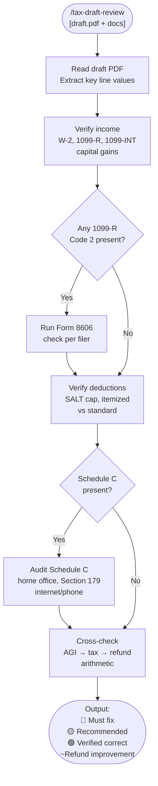

# tax-draft-review

A Claude Code skill that audits a U.S. Form 1040 draft return against known income documents before filing. It catches missing 1099-Rs (which trigger IRS CP2000 notices), wrong IRA basis on Form 8606, omitted Schedule C deductions, and SALT calculation errors — and produces a prioritized fix list with the exact line numbers and corrected values.

## What It Does

- Reads a draft PDF and extracts all key Form 1040 line values
- Cross-references income completeness: W-2s, all 1099-Rs (both spouses), Schedule B interest, capital gains/carryovers
- Verifies Form 8606 for backdoor Roth — checks Line 2 carryover and Code G/Code 2 separation
- Audits Schedule C for common omissions: home office, Section 179 equipment, internet/phone deductions
- Recomputes AGI → taxable income → tax → refund and flags arithmetic mismatches
- Outputs a priority-ranked report: must-fix errors, recommended additions, and verified-correct items

## Workflow



## Install

```bash
git clone https://github.com/biomystery/claude-skills /tmp/claude-skills
ln -s /tmp/claude-skills/tax/tax-draft-review ~/.claude/skills/tax-draft-review
```

## Usage

```
/tax-draft-review
```

Attach the draft PDF and as many supporting documents as available. Claude will ask for what's missing.

```
/tax-draft-review
(attach: draft.pdf, W2.pdf, 1099R_broker.pdf, prior_year_return.pdf)
```

## Output

**Sample output** (fictional values):

```
## Tax Draft Review — 2025

### 🔴 Must Fix Before Filing

1. Spouse 1099-R ($7,000 Code 2) missing from Line 4a
   Draft: $15,000 | Correct: $22,000
   Impact: IRS CP2000 notice if not filed; Line 4b unchanged if Form 8606 is correct

2. Form 8606 Line 2 blank (both filers)
   Should be $7,000 each (from prior year Line 14)
   Impact: ~$3,000 phantom taxable income → ~$660 overpaid federal tax

### 🟡 Recommended

3. Home office deduction not claimed (Schedule C Line 30)
   Simplified method: $5 × 30 sqft = $150
   Estimated savings: ~$33 federal + $14 CA

### 🟢 Verified Correct
  - W-2 wages match all W-2 Box 1 amounts ✅
  - Capital loss carryover ($168) applied correctly ✅
  - SALT cap ($40,000 for 2025) applied correctly ✅
  - Child Tax Credit (3 qualifying children × $2,200 = $6,600) ✅

### 📊 Summary
  Draft federal refund:    $2,200
  After must-fix items:   ~$2,860  (+$660)
  After recommendations:  ~$2,893  (+$33)
```

## Requirements

- Claude Code with PDF reading capability
- Draft tax return as a text-based PDF (software-prepared returns qualify; scanned images may not)
- Prior year's final return recommended (for carryover verification)

## Supported Checks

| Area | What Is Checked |
|---|---|
| W-2 income | All W-2 Box 1 amounts match Line 1a |
| IRA distributions | All 1099-Rs (both spouses) in Line 4a; Code G vs Code 2 classification |
| Form 8606 | Line 2 carryover, Line 8 Code 2 only, Line 18 expected $0 |
| Interest income | All known banks/brokers present in Schedule B |
| Capital gains | Prior-year loss carryover applied; Schedule D net |
| Deductions | SALT cap, itemized vs standard choice, QBI calculation |
| Schedule C | Gross receipts vs known income; home office, equipment, phone/internet |
| Arithmetic | AGI, taxable income, total tax, refund cross-check |

## Skill Structure

```
tax/tax-draft-review/
├── SKILL.md
└── README.md
```
