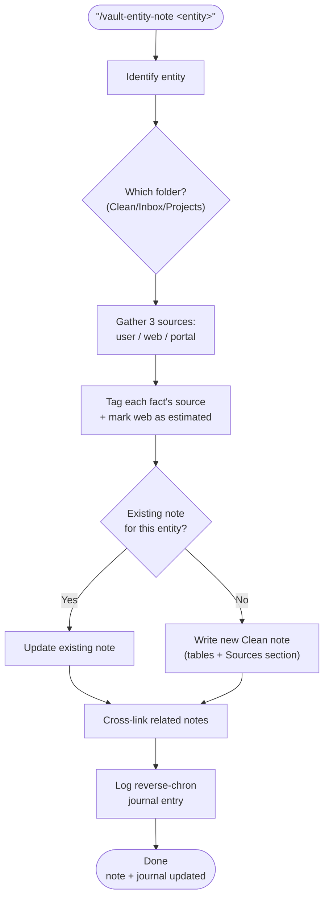

# vault-entity-note

Synthesizes a structured Obsidian reference note about a single real-world entity — a house, car, account, or policy — by merging what the user told you, public web records, and any data a portal or document surfaced during the session. It classifies the note into the correct vault folder, labels every fact's source, cross-links related notes, and announces the work in the daily journal.

## What It Does

- Classifies the note into the right folder (`Clean/` vs `Inbox/` vs `Projects/`) using the vault's decision tree
- Merges three source types and tags each fact: user-provided, public records (estimated), portal-pulled
- Marks public-record lookups as estimates (they often describe neighboring units)
- Never fabricates figures — unknowns are left as `— (to confirm)`
- Cross-links related notes with `[[wikilinks]]` and logs a reverse-chronological journal entry

## Workflow



## Install

```bash
mkdir -p ~/.claude/skills
cp -r vault-entity-note ~/.claude/skills/
```

## Usage

```
/vault-entity-note my house at 123 Example St
/vault-entity-note 2021 Honda Odyssey
```

## Output

- A reference note in `Clean/<Domain>/`
- A `HH:MM` reverse-chronological journal entry linking to it
- Refreshed `updated:` timestamps on any touched notes

**Sample output** (illustrative values):

```
Clean/Home/House - 100 Example St.md
  Identity: built 2000, 1,600 sq ft, 3 bd / 2.5 ba
  Financials: tax ~$8,000/yr (est., public records), purchase price — (to confirm)
  Sources: user-provided (reno, devices) · public records (size/tax, est.) · portal (assessor pull)
Journal: 14:30 🏠 created house reference note → [[Clean/Home/...]]
```

## Requirements

- Obsidian vault with `Clean/`, `Journals/YYYY/YYYY-WXX/`, `Projects/`
- `WebSearch` (optional, for public records)

## Supported Inputs / Edge Cases

- Exact public record missing → falls back to nearest unit, flagged as estimate
- Entity already documented → updates the existing note instead of duplicating
- Unknown figures → left blank with "to confirm", never invented

## Skill Structure

```
vault-entity-note/
├── SKILL.md
└── README.md
```
